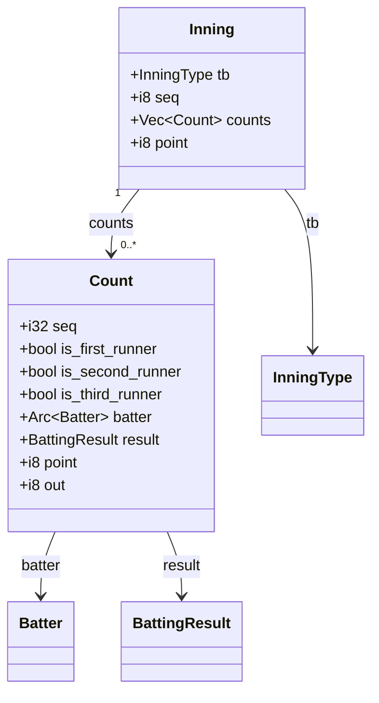

```mermaid
classDiagram
    class Inning {
        +InningType tb
        +i8 seq
        +Vec~Count~ counts
        +i8 point
    }

    class Count {
        +i32 seq
        +bool is_first_runner
        +bool is_second_runner
        +bool is_third_runner
        +Arc~Batter~ batter
        +BattingResult result
        +i8 point
        +i8 out
    }

    class InningType
    class Batter
    class BattingResult

    Inning "1" --> "0..*" Count : counts
    Count --> Batter : batter
    Count --> BattingResult : result
    Inning --> InningType : tb
```