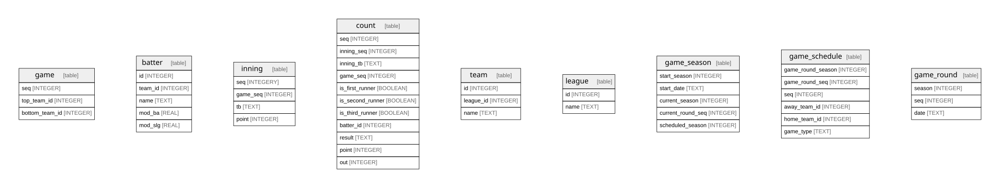

# saberbb.db

## Tables

| Name                                                | Columns | Comment | Type  |
| --------------------------------------------------- | ------- | ------- | ----- |
| [first_names](first_names.md)                       | 5       |         | table |
| [last_names](last_names.md)                         | 4       |         | table |
| [inning](inning.md)                                 | 3       |         | table |
| [league](league.md)                                 | 2       |         | table |
| [team](team.md)                                     | 3       |         | table |
| [game_season](game_season.md)                       | 4       |         | table |
| [game](game.md)                                     | 11      |         | table |
| [batting_order_history](batting_order_history.md)   | 11      |         | table |
| [batting_result_history](batting_result_history.md) | 8       |         | table |
| [count](count.md)                                   | 9       |         | table |
| [sqlite_stat1](sqlite_stat1.md)                     | 3       |         | table |
| [sqlite_stat4](sqlite_stat4.md)                     | 6       |         | table |
| [test_batted_ball](test_batted_ball.md)             | 6       |         | table |
| [player_info](player_info.md)                       | 6       |         | table |
| [fielder_info](fielder_info.md)                     | 6       |         | table |
| [batter_info](batter_info.md)                       | 7       |         | table |
| [running_skills](running_skills.md)                 | 4       |         | table |
| [item_weighted](item_weighted.md)                   | 4       |         | table |
| [normal_param](normal_param.md)                     | 8       |         | table |
| [gamma_param](gamma_param.md)                       | 6       |         | table |
| [pitcher_info](pitcher_info.md)                     | 10      |         | table |
| [defense_skills](defense_skills.md)                 | 2       |         | table |
| [pitch_skill](pitch_skill.md)                       | 13      |         | table |

## Relations

---

> Generated by [tbls](https://github.com/k1LoW/tbls)
