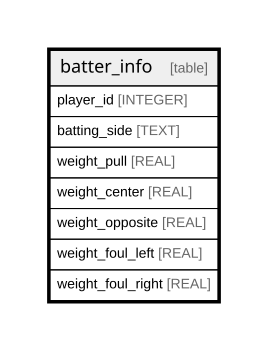

# batter_info

## Description

<details>
<summary><strong>Table Definition</strong></summary>

```sql
CREATE TABLE batter_info (
    player_id INTEGER PRIMARY KEY,
    batting_side TEXT NOT NULL,
    batter_type TEXT NOT NULL,
    zone_aptitude TEXT NOT NULL,
    hot_zone_scale REAL NOT NULL,
    batting_eye REAL NOT NULL,
    swing_speed REAL NOT NULL,
    swing_power REAL NOT NULL,
    attack_angle REAL NOT NULL,
    bat_control REAL NOT NULL,
    consistency REAL NOT NULL
)
```

</details>

## Columns

| Name           | Type    | Default | Nullable | Children | Parents | Comment |
| -------------- | ------- | ------- | -------- | -------- | ------- | ------- |
| player_id      | INTEGER |         | true     |          |         |         |
| batting_side   | TEXT    |         | false    |          |         |         |
| batter_type    | TEXT    |         | false    |          |         |         |
| zone_aptitude  | TEXT    |         | false    |          |         |         |
| hot_zone_scale | REAL    |         | false    |          |         |         |
| batting_eye    | REAL    |         | false    |          |         |         |
| swing_speed    | REAL    |         | false    |          |         |         |
| swing_power    | REAL    |         | false    |          |         |         |
| attack_angle   | REAL    |         | false    |          |         |         |
| bat_control    | REAL    |         | false    |          |         |         |
| consistency    | REAL    |         | false    |          |         |         |

## Constraints

| Name      | Type        | Definition              |
| --------- | ----------- | ----------------------- |
| player_id | PRIMARY KEY | PRIMARY KEY (player_id) |

## Relations



---

> Generated by [tbls](https://github.com/k1LoW/tbls)
