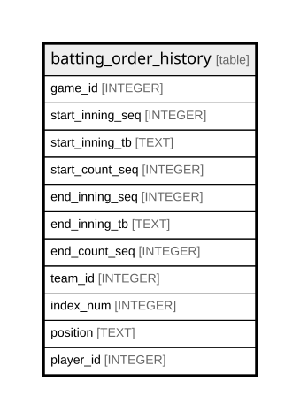

# batting_order_history

## Description

<details>
<summary><strong>Table Definition</strong></summary>

```sql
CREATE TABLE batting_order_history (
    game_id INTEGER,
    start_inning_seq INTEGER,
    start_inning_tb TEXT,
    start_count_seq INTEGER,
    end_inning_seq INTEGER,
    end_inning_tb TEXT,
    end_count_seq INTEGER,
    team_id INTEGER,
    index_num INTEGER,
    position TEXT,
    player_id INTEGER,
    PRIMARY KEY (
        game_id,
        start_inning_seq,
        start_inning_tb,
        start_count_seq,
        index_num
    )
)
```

</details>

## Columns

| Name             | Type    | Default | Nullable | Children | Parents | Comment |
| ---------------- | ------- | ------- | -------- | -------- | ------- | ------- |
| game_id          | INTEGER |         | true     |          |         |         |
| start_inning_seq | INTEGER |         | true     |          |         |         |
| start_inning_tb  | TEXT    |         | true     |          |         |         |
| start_count_seq  | INTEGER |         | true     |          |         |         |
| end_inning_seq   | INTEGER |         | true     |          |         |         |
| end_inning_tb    | TEXT    |         | true     |          |         |         |
| end_count_seq    | INTEGER |         | true     |          |         |         |
| team_id          | INTEGER |         | true     |          |         |         |
| index_num        | INTEGER |         | true     |          |         |         |
| position         | TEXT    |         | true     |          |         |         |
| player_id        | INTEGER |         | true     |          |         |         |

## Constraints

| Name                                     | Type        | Definition                                                                           |
| ---------------------------------------- | ----------- | ------------------------------------------------------------------------------------ |
| game_id                                  | PRIMARY KEY | PRIMARY KEY (game_id)                                                                |
| start_inning_seq                         | PRIMARY KEY | PRIMARY KEY (start_inning_seq)                                                       |
| start_inning_tb                          | PRIMARY KEY | PRIMARY KEY (start_inning_tb)                                                        |
| start_count_seq                          | PRIMARY KEY | PRIMARY KEY (start_count_seq)                                                        |
| index_num                                | PRIMARY KEY | PRIMARY KEY (index_num)                                                              |
| sqlite_autoindex_batting_order_history_1 | PRIMARY KEY | PRIMARY KEY (game_id, start_inning_seq, start_inning_tb, start_count_seq, index_num) |

## Indexes

| Name                                     | Definition                                                                           |
| ---------------------------------------- | ------------------------------------------------------------------------------------ |
| sqlite_autoindex_batting_order_history_1 | PRIMARY KEY (game_id, start_inning_seq, start_inning_tb, start_count_seq, index_num) |

## Relations



---

> Generated by [tbls](https://github.com/k1LoW/tbls)
