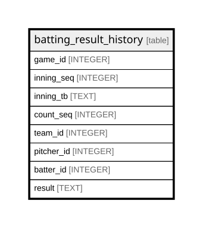

# batting_result_history

## Description

<details>
<summary><strong>Table Definition</strong></summary>

```sql
CREATE TABLE batting_result_history (
    game_id INTEGER,
    inning_seq INTEGER,
    inning_tb TEXT,
    count_seq INTEGER,
    team_id INTEGER,
    pitcher_id INTEGER,
    batter_id INTEGER,
    result TEXT NOT NULL,
    PRIMARY KEY (
        game_id,
        inning_seq,
        inning_tb,
        count_seq,
        batter_id
    )
)
```

</details>

## Columns

| Name       | Type    | Default | Nullable | Children | Parents | Comment |
| ---------- | ------- | ------- | -------- | -------- | ------- | ------- |
| game_id    | INTEGER |         | true     |          |         |         |
| inning_seq | INTEGER |         | true     |          |         |         |
| inning_tb  | TEXT    |         | true     |          |         |         |
| count_seq  | INTEGER |         | true     |          |         |         |
| team_id    | INTEGER |         | true     |          |         |         |
| pitcher_id | INTEGER |         | true     |          |         |         |
| batter_id  | INTEGER |         | true     |          |         |         |
| result     | TEXT    |         | false    |          |         |         |

## Constraints

| Name                                      | Type        | Definition                                                         |
| ----------------------------------------- | ----------- | ------------------------------------------------------------------ |
| game_id                                   | PRIMARY KEY | PRIMARY KEY (game_id)                                              |
| inning_seq                                | PRIMARY KEY | PRIMARY KEY (inning_seq)                                           |
| inning_tb                                 | PRIMARY KEY | PRIMARY KEY (inning_tb)                                            |
| count_seq                                 | PRIMARY KEY | PRIMARY KEY (count_seq)                                            |
| batter_id                                 | PRIMARY KEY | PRIMARY KEY (batter_id)                                            |
| sqlite_autoindex_batting_result_history_1 | PRIMARY KEY | PRIMARY KEY (game_id, inning_seq, inning_tb, count_seq, batter_id) |

## Indexes

| Name                                      | Definition                                                         |
| ----------------------------------------- | ------------------------------------------------------------------ |
| sqlite_autoindex_batting_result_history_1 | PRIMARY KEY (game_id, inning_seq, inning_tb, count_seq, batter_id) |

## Relations



---

> Generated by [tbls](https://github.com/k1LoW/tbls)
