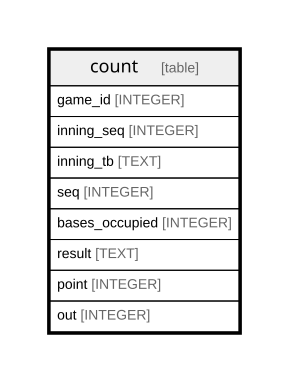

# count

## Description

<details>
<summary><strong>Table Definition</strong></summary>

```sql
CREATE TABLE count (
    game_id INTEGER,
    inning_seq INTEGER,
    inning_tb TEXT,
    seq INTEGER,
    bases_occupied INTEGER NOT NULL DEFAULT 0,
    batter_id INTEGER,
    result TEXT NOT NULL,
    point INTEGER NOT NULL,
    out INTEGER NOT NULL,
    PRIMARY KEY (
        game_id,
        inning_seq,
        inning_tb,
        seq
    )
)
```

</details>

## Columns

| Name           | Type    | Default | Nullable | Children | Parents | Comment |
| -------------- | ------- | ------- | -------- | -------- | ------- | ------- |
| game_id        | INTEGER |         | true     |          |         |         |
| inning_seq     | INTEGER |         | true     |          |         |         |
| inning_tb      | TEXT    |         | true     |          |         |         |
| seq            | INTEGER |         | true     |          |         |         |
| bases_occupied | INTEGER | 0       | false    |          |         |         |
| batter_id      | INTEGER |         | true     |          |         |         |
| result         | TEXT    |         | false    |          |         |         |
| point          | INTEGER |         | false    |          |         |         |
| out            | INTEGER |         | false    |          |         |         |

## Constraints

| Name                     | Type        | Definition                                        |
| ------------------------ | ----------- | ------------------------------------------------- |
| game_id                  | PRIMARY KEY | PRIMARY KEY (game_id)                             |
| inning_seq               | PRIMARY KEY | PRIMARY KEY (inning_seq)                          |
| inning_tb                | PRIMARY KEY | PRIMARY KEY (inning_tb)                           |
| seq                      | PRIMARY KEY | PRIMARY KEY (seq)                                 |
| sqlite_autoindex_count_1 | PRIMARY KEY | PRIMARY KEY (game_id, inning_seq, inning_tb, seq) |

## Indexes

| Name                     | Definition                                        |
| ------------------------ | ------------------------------------------------- |
| sqlite_autoindex_count_1 | PRIMARY KEY (game_id, inning_seq, inning_tb, seq) |

## Relations



---

> Generated by [tbls](https://github.com/k1LoW/tbls)
