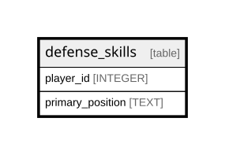

# defense_skills

## Description

<details>
<summary><strong>Table Definition</strong></summary>

```sql
CREATE TABLE defense_skills (
    player_id INTEGER PRIMARY KEY,
    position TEXT NOT NULL
)
```

</details>

## Columns

| Name      | Type    | Default | Nullable | Children | Parents | Comment |
| --------- | ------- | ------- | -------- | -------- | ------- | ------- |
| player_id | INTEGER |         | true     |          |         |         |
| position  | TEXT    |         | false    |          |         |         |

## Constraints

| Name      | Type        | Definition              |
| --------- | ----------- | ----------------------- |
| player_id | PRIMARY KEY | PRIMARY KEY (player_id) |

## Relations



---

> Generated by [tbls](https://github.com/k1LoW/tbls)
