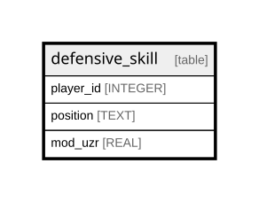

# defensive_skill

## Description

<details>
<summary><strong>Table Definition</strong></summary>

```sql
CREATE TABLE defensive_skill (
    player_id INTEGER,
    position TEXT,
    mod_uzr REAL NOT NULL,
    PRIMARY KEY (player_id, position)
)
```

</details>

## Columns

| Name      | Type    | Default | Nullable | Children | Parents | Comment |
| --------- | ------- | ------- | -------- | -------- | ------- | ------- |
| player_id | INTEGER |         | true     |          |         |         |
| position  | TEXT    |         | true     |          |         |         |
| mod_uzr   | REAL    |         | false    |          |         |         |

## Constraints

| Name                               | Type        | Definition                        |
| ---------------------------------- | ----------- | --------------------------------- |
| player_id                          | PRIMARY KEY | PRIMARY KEY (player_id)           |
| position                           | PRIMARY KEY | PRIMARY KEY (position)            |
| sqlite_autoindex_defensive_skill_1 | PRIMARY KEY | PRIMARY KEY (player_id, position) |

## Indexes

| Name                               | Definition                        |
| ---------------------------------- | --------------------------------- |
| sqlite_autoindex_defensive_skill_1 | PRIMARY KEY (player_id, position) |

## Relations



---

> Generated by [tbls](https://github.com/k1LoW/tbls)
