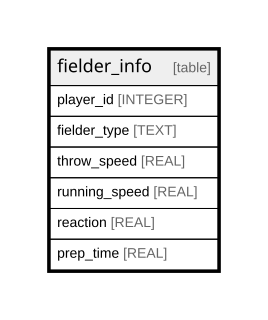

# fielder_info

## Description

<details>
<summary><strong>Table Definition</strong></summary>

```sql
CREATE TABLE fielder_info (
    player_id INTEGER,
    fielder_type TEXT,
    throw_speed REAL NOT NULL,
    running_speed REAL NOT NULL,
    reaction REAL NOT NULL,
    prep_time REAL NOT NULL,
    PRIMARY KEY (player_id, fielder_type)
)
```

</details>

## Columns

| Name          | Type    | Default | Nullable | Children | Parents | Comment |
| ------------- | ------- | ------- | -------- | -------- | ------- | ------- |
| player_id     | INTEGER |         | true     |          |         |         |
| fielder_type  | TEXT    |         | true     |          |         |         |
| throw_speed   | REAL    |         | false    |          |         |         |
| running_speed | REAL    |         | false    |          |         |         |
| reaction      | REAL    |         | false    |          |         |         |
| prep_time     | REAL    |         | false    |          |         |         |

## Constraints

| Name                            | Type        | Definition                            |
| ------------------------------- | ----------- | ------------------------------------- |
| player_id                       | PRIMARY KEY | PRIMARY KEY (player_id)               |
| fielder_type                    | PRIMARY KEY | PRIMARY KEY (fielder_type)            |
| sqlite_autoindex_fielder_info_1 | PRIMARY KEY | PRIMARY KEY (player_id, fielder_type) |

## Indexes

| Name                            | Definition                            |
| ------------------------------- | ------------------------------------- |
| sqlite_autoindex_fielder_info_1 | PRIMARY KEY (player_id, fielder_type) |

## Relations



---

> Generated by [tbls](https://github.com/k1LoW/tbls)
