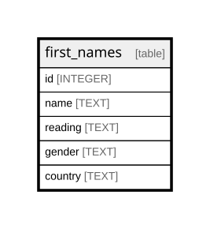

# first_names

## Description

<details>
<summary><strong>Table Definition</strong></summary>

```sql
CREATE TABLE "first_names" (
    id INTEGER PRIMARY KEY AUTOINCREMENT,
    name TEXT
  , reading TEXT
  , gender TEXT
  , country TEXT
)
```

</details>

## Columns

| Name    | Type    | Default | Nullable | Children | Parents | Comment |
| ------- | ------- | ------- | -------- | -------- | ------- | ------- |
| id      | INTEGER |         | true     |          |         |         |
| name    | TEXT    |         | true     |          |         |         |
| reading | TEXT    |         | true     |          |         |         |
| gender  | TEXT    |         | true     |          |         |         |
| country | TEXT    |         | true     |          |         |         |

## Constraints

| Name | Type        | Definition       |
| ---- | ----------- | ---------------- |
| id   | PRIMARY KEY | PRIMARY KEY (id) |

## Relations



---

> Generated by [tbls](https://github.com/k1LoW/tbls)
