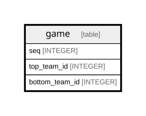

# game

## Description

<details>
<summary><strong>Table Definition</strong></summary>

```sql
CREATE TABLE game (
    game_round_season INTEGER,
    game_round_seq INTEGER,
    seq INTEGER,
    date TEXT NOT NULL,
    away_team_id INTEGER NOT NULL,
    home_team_id INTEGER NOT NULL,
    game_type TEXT NOT NULL,
    PRIMARY KEY (
        game_round_season,
        game_round_seq,
        seq,
        away_team_id,
        home_team_id
    )
)
```

</details>

## Columns

| Name              | Type    | Default | Nullable | Children | Parents | Comment |
| ----------------- | ------- | ------- | -------- | -------- | ------- | ------- |
| game_round_season | INTEGER |         | true     |          |         |         |
| game_round_seq    | INTEGER |         | true     |          |         |         |
| seq               | INTEGER |         | true     |          |         |         |
| date              | TEXT    |         | false    |          |         |         |
| away_team_id      | INTEGER |         | false    |          |         |         |
| home_team_id      | INTEGER |         | false    |          |         |         |
| game_type         | TEXT    |         | false    |          |         |         |

## Constraints

| Name                    | Type        | Definition                                                                       |
| ----------------------- | ----------- | -------------------------------------------------------------------------------- |
| game_round_season       | PRIMARY KEY | PRIMARY KEY (game_round_season)                                                  |
| game_round_seq          | PRIMARY KEY | PRIMARY KEY (game_round_seq)                                                     |
| seq                     | PRIMARY KEY | PRIMARY KEY (seq)                                                                |
| away_team_id            | PRIMARY KEY | PRIMARY KEY (away_team_id)                                                       |
| home_team_id            | PRIMARY KEY | PRIMARY KEY (home_team_id)                                                       |
| sqlite_autoindex_game_1 | PRIMARY KEY | PRIMARY KEY (game_round_season, game_round_seq, seq, away_team_id, home_team_id) |

## Indexes

| Name                    | Definition                                                                       |
| ----------------------- | -------------------------------------------------------------------------------- |
| sqlite_autoindex_game_1 | PRIMARY KEY (game_round_season, game_round_seq, seq, away_team_id, home_team_id) |

## Relations



---

> Generated by [tbls](https://github.com/k1LoW/tbls)
