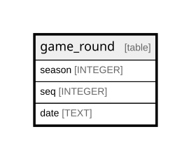

# game_round

## Description

<details>
<summary><strong>Table Definition</strong></summary>

```sql
CREATE TABLE game_round (
    id INTEGER,
    season INTEGER,
    seq INTEGER,
    date TEXT NOT NULL,
    PRIMARY KEY (id)
)
```

</details>

## Columns

| Name   | Type    | Default | Nullable | Children | Parents | Comment |
| ------ | ------- | ------- | -------- | -------- | ------- | ------- |
| id     | INTEGER |         | true     |          |         |         |
| season | INTEGER |         | true     |          |         |         |
| seq    | INTEGER |         | true     |          |         |         |
| date   | TEXT    |         | false    |          |         |         |

## Constraints

| Name | Type        | Definition       |
| ---- | ----------- | ---------------- |
| id   | PRIMARY KEY | PRIMARY KEY (id) |

## Relations



---

> Generated by [tbls](https://github.com/k1LoW/tbls)
