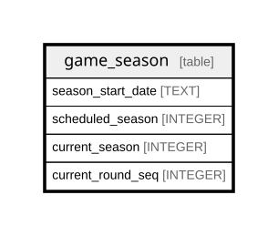

# game_season

## Description

<details>
<summary><strong>Table Definition</strong></summary>

```sql
CREATE TABLE game_season (
    start_season INTEGER NOT NULL,
    start_date TEXT NOT NULL,
    current_season INTEGER NOT NULL,
    current_round_seq INTEGER NOT NULL,
    scheduled_season INTEGER NOT NULL
)
```

</details>

## Columns

| Name              | Type    | Default | Nullable | Children | Parents | Comment |
| ----------------- | ------- | ------- | -------- | -------- | ------- | ------- |
| start_season      | INTEGER |         | false    |          |         |         |
| start_date        | TEXT    |         | false    |          |         |         |
| current_season    | INTEGER |         | false    |          |         |         |
| current_round_seq | INTEGER |         | false    |          |         |         |
| scheduled_season  | INTEGER |         | false    |          |         |         |

## Relations



---

> Generated by [tbls](https://github.com/k1LoW/tbls)
