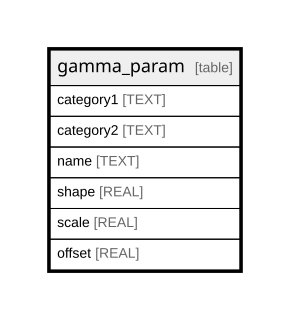

# gamma_param

## Description

<details>
<summary><strong>Table Definition</strong></summary>

```sql
CREATE TABLE gamma_param (
    category1 TEXT,
    category2 TEXT,
    name TEXT,
    shape REAL NOT NULL,
    scale REAL NOT NULL,
    offset REAL NOT NULL,
    PRIMARY KEY (category1, category2, name)
)
```

</details>

## Columns

| Name      | Type | Default | Nullable | Children | Parents | Comment |
| --------- | ---- | ------- | -------- | -------- | ------- | ------- |
| category1 | TEXT |         | true     |          |         |         |
| category2 | TEXT |         | true     |          |         |         |
| name      | TEXT |         | true     |          |         |         |
| shape     | REAL |         | false    |          |         |         |
| scale     | REAL |         | false    |          |         |         |
| offset    | REAL |         | false    |          |         |         |

## Constraints

| Name                           | Type        | Definition                               |
| ------------------------------ | ----------- | ---------------------------------------- |
| category1                      | PRIMARY KEY | PRIMARY KEY (category1)                  |
| category2                      | PRIMARY KEY | PRIMARY KEY (category2)                  |
| name                           | PRIMARY KEY | PRIMARY KEY (name)                       |
| sqlite_autoindex_gamma_param_1 | PRIMARY KEY | PRIMARY KEY (category1, category2, name) |

## Indexes

| Name                           | Definition                               |
| ------------------------------ | ---------------------------------------- |
| sqlite_autoindex_gamma_param_1 | PRIMARY KEY (category1, category2, name) |

## Relations



---

> Generated by [tbls](https://github.com/k1LoW/tbls)
