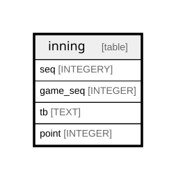

# inning

## Description

<details>
<summary><strong>Table Definition</strong></summary>

```sql
CREATE TABLE inning (
    game_id INTEGER,
    seq INTEGER,
    tb TEXT,
    PRIMARY KEY (game_id, seq, tb)
)
```

</details>

## Columns

| Name    | Type    | Default | Nullable | Children | Parents | Comment |
| ------- | ------- | ------- | -------- | -------- | ------- | ------- |
| game_id | INTEGER |         | true     |          |         |         |
| seq     | INTEGER |         | true     |          |         |         |
| tb      | TEXT    |         | true     |          |         |         |

## Constraints

| Name                      | Type        | Definition                     |
| ------------------------- | ----------- | ------------------------------ |
| game_id                   | PRIMARY KEY | PRIMARY KEY (game_id)          |
| seq                       | PRIMARY KEY | PRIMARY KEY (seq)              |
| tb                        | PRIMARY KEY | PRIMARY KEY (tb)               |
| sqlite_autoindex_inning_1 | PRIMARY KEY | PRIMARY KEY (game_id, seq, tb) |

## Indexes

| Name                      | Definition                     |
| ------------------------- | ------------------------------ |
| sqlite_autoindex_inning_1 | PRIMARY KEY (game_id, seq, tb) |

## Relations



---

> Generated by [tbls](https://github.com/k1LoW/tbls)
