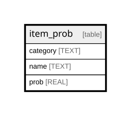

# item_prob

## Description

<details>
<summary><strong>Table Definition</strong></summary>

```sql
CREATE TABLE item_prob (
    category TEXT,
    name TEXT,
    prob REAL NOT NULL,
    PRIMARY KEY (category, name)
)
```

</details>

## Columns

| Name     | Type | Default | Nullable | Children | Parents | Comment |
| -------- | ---- | ------- | -------- | -------- | ------- | ------- |
| category | TEXT |         | true     |          |         |         |
| name     | TEXT |         | true     |          |         |         |
| prob     | REAL |         | false    |          |         |         |

## Constraints

| Name                         | Type        | Definition                   |
| ---------------------------- | ----------- | ---------------------------- |
| category                     | PRIMARY KEY | PRIMARY KEY (category)       |
| name                         | PRIMARY KEY | PRIMARY KEY (name)           |
| sqlite_autoindex_item_prob_1 | PRIMARY KEY | PRIMARY KEY (category, name) |

## Indexes

| Name                         | Definition                   |
| ---------------------------- | ---------------------------- |
| sqlite_autoindex_item_prob_1 | PRIMARY KEY (category, name) |

## Relations



---

> Generated by [tbls](https://github.com/k1LoW/tbls)
