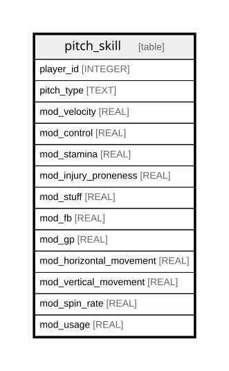

# pitch_skill

## Description

<details>
<summary><strong>Table Definition</strong></summary>

```sql
CREATE TABLE pitch_skill (
    player_id INTEGER,
    pitch_type TEXT,
    velocity REAL NOT NULL,
    control REAL NOT NULL,
    stamina REAL NOT NULL,
    injury_proneness REAL NOT NULL,
    spin_rate REAL NOT NULL,
    spin_angle REAL NOT NULL,
    spin_efficiency REAL NOT NULL,
    usage REAL NOT NULL,
    PRIMARY KEY (player_id, pitch_type)
)
```

</details>

## Columns

| Name             | Type    | Default | Nullable | Children | Parents | Comment |
| ---------------- | ------- | ------- | -------- | -------- | ------- | ------- |
| player_id        | INTEGER |         | true     |          |         |         |
| pitch_type       | TEXT    |         | true     |          |         |         |
| velocity         | REAL    |         | false    |          |         |         |
| control          | REAL    |         | false    |          |         |         |
| stamina          | REAL    |         | false    |          |         |         |
| injury_proneness | REAL    |         | false    |          |         |         |
| spin_rate        | REAL    |         | false    |          |         |         |
| spin_angle       | REAL    |         | false    |          |         |         |
| spin_efficiency  | REAL    |         | false    |          |         |         |
| usage            | REAL    |         | false    |          |         |         |

## Constraints

| Name                           | Type        | Definition                          |
| ------------------------------ | ----------- | ----------------------------------- |
| player_id                      | PRIMARY KEY | PRIMARY KEY (player_id)             |
| pitch_type                     | PRIMARY KEY | PRIMARY KEY (pitch_type)            |
| sqlite_autoindex_pitch_skill_1 | PRIMARY KEY | PRIMARY KEY (player_id, pitch_type) |

## Indexes

| Name                           | Definition                          |
| ------------------------------ | ----------------------------------- |
| sqlite_autoindex_pitch_skill_1 | PRIMARY KEY (player_id, pitch_type) |

## Relations



---

> Generated by [tbls](https://github.com/k1LoW/tbls)
