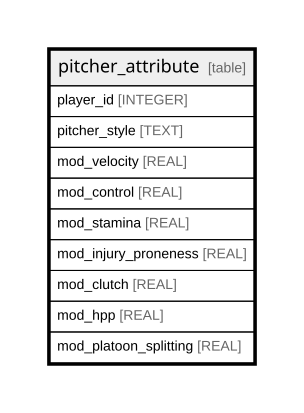

# pitcher_attribute

## Description

<details>
<summary><strong>Table Definition</strong></summary>

```sql
CREATE TABLE pitcher_attribute (
    player_id INTEGER,
    pitcher_style TEXT,
    mod_velocity REAL NOT NULL,
    mod_control REAL NOT NULL,
    mod_stamina REAL NOT NULL,
    mod_injury_proneness REAL NOT NULL,
    mod_clutch REAL NOT NULL,
    mod_hpp REAL NOT NULL,
    mod_platoon_splitting REAL NOT NULL,
    PRIMARY KEY (player_id, pitcher_style)
)
```

</details>

## Columns

| Name                  | Type    | Default | Nullable | Children | Parents | Comment |
| --------------------- | ------- | ------- | -------- | -------- | ------- | ------- |
| player_id             | INTEGER |         | true     |          |         |         |
| pitcher_style         | TEXT    |         | true     |          |         |         |
| mod_velocity          | REAL    |         | false    |          |         |         |
| mod_control           | REAL    |         | false    |          |         |         |
| mod_stamina           | REAL    |         | false    |          |         |         |
| mod_injury_proneness  | REAL    |         | false    |          |         |         |
| mod_clutch            | REAL    |         | false    |          |         |         |
| mod_hpp               | REAL    |         | false    |          |         |         |
| mod_platoon_splitting | REAL    |         | false    |          |         |         |

## Constraints

| Name                                 | Type        | Definition                             |
| ------------------------------------ | ----------- | -------------------------------------- |
| player_id                            | PRIMARY KEY | PRIMARY KEY (player_id)                |
| pitcher_style                        | PRIMARY KEY | PRIMARY KEY (pitcher_style)            |
| sqlite_autoindex_pitcher_attribute_1 | PRIMARY KEY | PRIMARY KEY (player_id, pitcher_style) |

## Indexes

| Name                                 | Definition                             |
| ------------------------------------ | -------------------------------------- |
| sqlite_autoindex_pitcher_attribute_1 | PRIMARY KEY (player_id, pitcher_style) |

## Relations



---

> Generated by [tbls](https://github.com/k1LoW/tbls)
