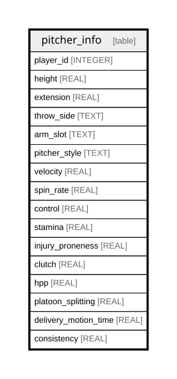

# pitcher_info

## Description

<details>
<summary><strong>Table Definition</strong></summary>

```sql
CREATE TABLE pitcher_info(
    player_id INTEGER PRIMARY KEY,
    throw_side TEXT NOT NULL,
    arm_slot TEXT NOT NULL,
    pitcher_style TEXT NOT NULL,
    velocity REAL NOT NULL,
    control REAL NOT NULL,
    stamina REAL NOT NULL,
    injury_proneness REAL NOT NULL,
    clutch REAL NOT NULL,
    hpp REAL NOT NULL,
    platoon_splitting REAL NOT NULL,
    delivery_motion_time REAL NOT NULL
)
```

</details>

## Columns

| Name                 | Type    | Default | Nullable | Children | Parents | Comment |
| -------------------- | ------- | ------- | -------- | -------- | ------- | ------- |
| player_id            | INTEGER |         | true     |          |         |         |
| throw_side           | TEXT    |         | false    |          |         |         |
| arm_slot             | TEXT    |         | false    |          |         |         |
| pitcher_style        | TEXT    |         | false    |          |         |         |
| velocity             | REAL    |         | false    |          |         |         |
| control              | REAL    |         | false    |          |         |         |
| stamina              | REAL    |         | false    |          |         |         |
| injury_proneness     | REAL    |         | false    |          |         |         |
| clutch               | REAL    |         | false    |          |         |         |
| hpp                  | REAL    |         | false    |          |         |         |
| platoon_splitting    | REAL    |         | false    |          |         |         |
| delivery_motion_time | REAL    |         | false    |          |         |         |

## Constraints

| Name      | Type        | Definition              |
| --------- | ----------- | ----------------------- |
| player_id | PRIMARY KEY | PRIMARY KEY (player_id) |

## Relations



---

> Generated by [tbls](https://github.com/k1LoW/tbls)
