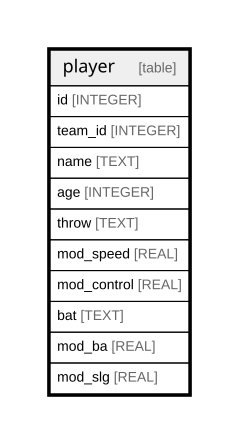

# player

## Description

<details>
<summary><strong>Table Definition</strong></summary>

```sql
CREATE TABLE player (
    id INTEGER PRIMARY KEY AUTOINCREMENT
  , team_id INTEGER NOT NULL
  , first_name TEXT NOT NULL
  , last_name TEXT NOT NULL
  , age INTEGER NOT NULL
  , throw TEXT NOT NULL
  , mod_speed REAL NOT NULL
  , mod_control REAL NOT NULL
  , bat TEXT NOT NULL
  , mod_ba REAL NOT NULL
  , mod_slg REAL NOT NULL
)
```

</details>

## Columns

| Name        | Type    | Default | Nullable | Children | Parents | Comment |
| ----------- | ------- | ------- | -------- | -------- | ------- | ------- |
| id          | INTEGER |         | true     |          |         |         |
| team_id     | INTEGER |         | false    |          |         |         |
| first_name  | TEXT    |         | false    |          |         |         |
| last_name   | TEXT    |         | false    |          |         |         |
| age         | INTEGER |         | false    |          |         |         |
| throw       | TEXT    |         | false    |          |         |         |
| mod_speed   | REAL    |         | false    |          |         |         |
| mod_control | REAL    |         | false    |          |         |         |
| bat         | TEXT    |         | false    |          |         |         |
| mod_ba      | REAL    |         | false    |          |         |         |
| mod_slg     | REAL    |         | false    |          |         |         |

## Constraints

| Name | Type        | Definition       |
| ---- | ----------- | ---------------- |
| id   | PRIMARY KEY | PRIMARY KEY (id) |

## Relations



---

> Generated by [tbls](https://github.com/k1LoW/tbls)
