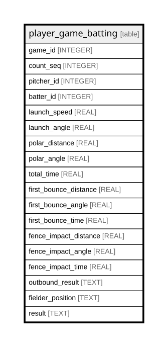

# player_game_batting

## Description

<details>
<summary><strong>Table Definition</strong></summary>

```sql
CREATE TABLE player_game_batting (
    game_id INTEGER,
    count_seq INTEGER,
    pitcher_id INTEGER NOT NULL,
    batter_id INTEGER NOT NULL,
    launch_speed REAL NOT NULL,
    launch_angle REAL NOT NULL,
    polar_distance REAL NOT NULL,
    polar_angle REAL NOT NULL,
    hang_time REAL NOT NULL,
    trajectory TEXT NOT NULL,
    fielder_position TEXT,
    result TEXT NOT NULL,
    PRIMARY KEY (game_id, count_seq)
)
```

</details>

## Columns

| Name             | Type    | Default | Nullable | Children | Parents | Comment |
| ---------------- | ------- | ------- | -------- | -------- | ------- | ------- |
| game_id          | INTEGER |         | true     |          |         |         |
| count_seq        | INTEGER |         | true     |          |         |         |
| pitcher_id       | INTEGER |         | false    |          |         |         |
| batter_id        | INTEGER |         | false    |          |         |         |
| launch_speed     | REAL    |         | false    |          |         |         |
| launch_angle     | REAL    |         | false    |          |         |         |
| polar_distance   | REAL    |         | false    |          |         |         |
| polar_angle      | REAL    |         | false    |          |         |         |
| hang_time        | REAL    |         | false    |          |         |         |
| trajectory       | TEXT    |         | false    |          |         |         |
| fielder_position | TEXT    |         | true     |          |         |         |
| result           | TEXT    |         | false    |          |         |         |

## Constraints

| Name                                   | Type        | Definition                       |
| -------------------------------------- | ----------- | -------------------------------- |
| game_id                                | PRIMARY KEY | PRIMARY KEY (game_id)            |
| count_seq                              | PRIMARY KEY | PRIMARY KEY (count_seq)          |
| sqlite_autoindex_player_game_batting_1 | PRIMARY KEY | PRIMARY KEY (game_id, count_seq) |

## Indexes

| Name                                   | Definition                       |
| -------------------------------------- | -------------------------------- |
| sqlite_autoindex_player_game_batting_1 | PRIMARY KEY (game_id, count_seq) |

## Relations



---

> Generated by [tbls](https://github.com/k1LoW/tbls)
