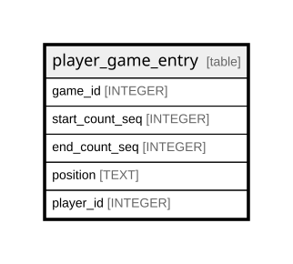

# player_game_entry

## Description

<details>
<summary><strong>Table Definition</strong></summary>

```sql
CREATE TABLE player_game_entry (
    game_id INTEGER,
    start_count_seq INTEGER,
    end_count_seq INTEGER,
    position TEXT,
    batting_order INTEGER,
    player_id INTEGER,
    PRIMARY KEY (
        game_id,
        start_count_seq,
        player_id
    )
)
```

</details>

## Columns

| Name            | Type    | Default | Nullable | Children | Parents | Comment |
| --------------- | ------- | ------- | -------- | -------- | ------- | ------- |
| game_id         | INTEGER |         | true     |          |         |         |
| start_count_seq | INTEGER |         | true     |          |         |         |
| end_count_seq   | INTEGER |         | true     |          |         |         |
| position        | TEXT    |         | true     |          |         |         |
| batting_order   | INTEGER |         | true     |          |         |         |
| player_id       | INTEGER |         | true     |          |         |         |

## Constraints

| Name                                 | Type        | Definition                                        |
| ------------------------------------ | ----------- | ------------------------------------------------- |
| game_id                              | PRIMARY KEY | PRIMARY KEY (game_id)                             |
| start_count_seq                      | PRIMARY KEY | PRIMARY KEY (start_count_seq)                     |
| player_id                            | PRIMARY KEY | PRIMARY KEY (player_id)                           |
| sqlite_autoindex_player_game_entry_1 | PRIMARY KEY | PRIMARY KEY (game_id, start_count_seq, player_id) |

## Indexes

| Name                                 | Definition                                        |
| ------------------------------------ | ------------------------------------------------- |
| sqlite_autoindex_player_game_entry_1 | PRIMARY KEY (game_id, start_count_seq, player_id) |

## Relations



---

> Generated by [tbls](https://github.com/k1LoW/tbls)
