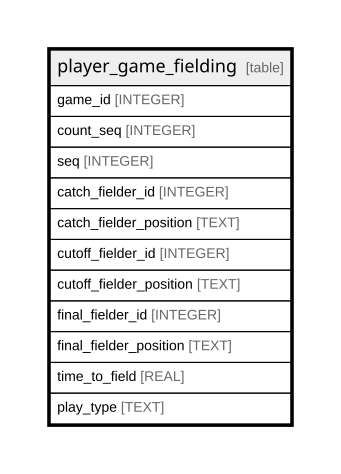

# player_game_fielding

## Description

<details>
<summary><strong>Table Definition</strong></summary>

```sql
CREATE TABLE player_game_fielding (
    game_id INTEGER,
    count_seq INTEGER,
    seq INTEGER,
    catch_fielder_id INTEGER NOT NULL,
    catch_fielder_position TEXT NOT NULL,
    cutoff_fielder_id INTEGER,
    cutoff_fielder_position TEXT,
    final_fielder_id INTEGER,
    final_fielder_position TEXT,
    time_to_field REAL NOT NULL,
    play_type TEXT NOT NULL,
    PRIMARY KEY (game_id, count_seq, seq)
)
```

</details>

## Columns

| Name                    | Type    | Default | Nullable | Children | Parents | Comment |
| ----------------------- | ------- | ------- | -------- | -------- | ------- | ------- |
| game_id                 | INTEGER |         | true     |          |         |         |
| count_seq               | INTEGER |         | true     |          |         |         |
| seq                     | INTEGER |         | true     |          |         |         |
| catch_fielder_id        | INTEGER |         | false    |          |         |         |
| catch_fielder_position  | TEXT    |         | false    |          |         |         |
| cutoff_fielder_id       | INTEGER |         | true     |          |         |         |
| cutoff_fielder_position | TEXT    |         | true     |          |         |         |
| final_fielder_id        | INTEGER |         | true     |          |         |         |
| final_fielder_position  | TEXT    |         | true     |          |         |         |
| time_to_field           | REAL    |         | false    |          |         |         |
| play_type               | TEXT    |         | false    |          |         |         |

## Constraints

| Name                                    | Type        | Definition                            |
| --------------------------------------- | ----------- | ------------------------------------- |
| game_id                                 | PRIMARY KEY | PRIMARY KEY (game_id)                 |
| count_seq                               | PRIMARY KEY | PRIMARY KEY (count_seq)               |
| seq                                     | PRIMARY KEY | PRIMARY KEY (seq)                     |
| sqlite_autoindex_player_game_fielding_1 | PRIMARY KEY | PRIMARY KEY (game_id, count_seq, seq) |

## Indexes

| Name                                    | Definition                            |
| --------------------------------------- | ------------------------------------- |
| sqlite_autoindex_player_game_fielding_1 | PRIMARY KEY (game_id, count_seq, seq) |

## Relations



---

> Generated by [tbls](https://github.com/k1LoW/tbls)
