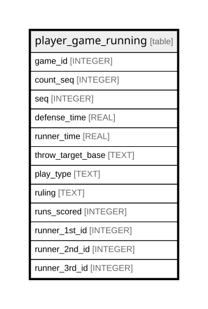

# player_game_running

## Description

<details>
<summary><strong>Table Definition</strong></summary>

```sql
CREATE TABLE player_game_running (
    game_id INTEGER,
    count_seq INTEGER,
    seq INTEGER,
    defense_time REAL NOT NULL,
    runner_time REAL NOT NULL,
    throw_target_base TEXT NOT NULL,
    play_type TEXT NOT NULL,
    ruling TEXT NOT NULL,
    runs_scored INTEGER NOT NULL,
    runner_1st_id INTEGER,
    runner_2nd_id INTEGER,
    runner_3rd_id INTEGER,
    PRIMARY KEY (game_id, count_seq, seq)
)
```

</details>

## Columns

| Name              | Type    | Default | Nullable | Children | Parents | Comment |
| ----------------- | ------- | ------- | -------- | -------- | ------- | ------- |
| game_id           | INTEGER |         | true     |          |         |         |
| count_seq         | INTEGER |         | true     |          |         |         |
| seq               | INTEGER |         | true     |          |         |         |
| defense_time      | REAL    |         | false    |          |         |         |
| runner_time       | REAL    |         | false    |          |         |         |
| throw_target_base | TEXT    |         | false    |          |         |         |
| play_type         | TEXT    |         | false    |          |         |         |
| ruling            | TEXT    |         | false    |          |         |         |
| runs_scored       | INTEGER |         | false    |          |         |         |
| runner_1st_id     | INTEGER |         | true     |          |         |         |
| runner_2nd_id     | INTEGER |         | true     |          |         |         |
| runner_3rd_id     | INTEGER |         | true     |          |         |         |

## Constraints

| Name                                   | Type        | Definition                            |
| -------------------------------------- | ----------- | ------------------------------------- |
| game_id                                | PRIMARY KEY | PRIMARY KEY (game_id)                 |
| count_seq                              | PRIMARY KEY | PRIMARY KEY (count_seq)               |
| seq                                    | PRIMARY KEY | PRIMARY KEY (seq)                     |
| sqlite_autoindex_player_game_running_1 | PRIMARY KEY | PRIMARY KEY (game_id, count_seq, seq) |

## Indexes

| Name                                   | Definition                            |
| -------------------------------------- | ------------------------------------- |
| sqlite_autoindex_player_game_running_1 | PRIMARY KEY (game_id, count_seq, seq) |

## Relations



---

> Generated by [tbls](https://github.com/k1LoW/tbls)
