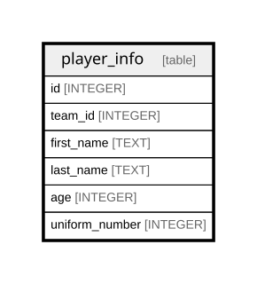

# player_info

## Description

<details>
<summary><strong>Table Definition</strong></summary>

```sql
CREATE TABLE player_info (
    id INTEGER PRIMARY KEY AUTOINCREMENT,
    team_id INTEGER NOT NULL,
    first_name TEXT NOT NULL,
    last_name TEXT NOT NULL,
    age INTEGER NOT NULL,
    uniform_number INTEGER NOT NULL
)
```

</details>

## Columns

| Name           | Type    | Default | Nullable | Children | Parents | Comment |
| -------------- | ------- | ------- | -------- | -------- | ------- | ------- |
| id             | INTEGER |         | true     |          |         |         |
| team_id        | INTEGER |         | false    |          |         |         |
| first_name     | TEXT    |         | false    |          |         |         |
| last_name      | TEXT    |         | false    |          |         |         |
| age            | INTEGER |         | false    |          |         |         |
| uniform_number | INTEGER |         | false    |          |         |         |

## Constraints

| Name | Type        | Definition       |
| ---- | ----------- | ---------------- |
| id   | PRIMARY KEY | PRIMARY KEY (id) |

## Relations



---

> Generated by [tbls](https://github.com/k1LoW/tbls)
