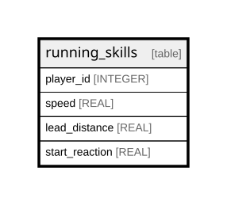

# running_skills

## Description

<details>
<summary><strong>Table Definition</strong></summary>

```sql
CREATE TABLE running_skills (
    player_id INTEGER PRIMARY KEY,
    speed REAL NOT NULL,
    lead_distance REAL NOT NULL,
    start_reaction REAL NOT NULL
)
```

</details>

## Columns

| Name           | Type    | Default | Nullable | Children | Parents | Comment |
| -------------- | ------- | ------- | -------- | -------- | ------- | ------- |
| player_id      | INTEGER |         | true     |          |         |         |
| speed          | REAL    |         | false    |          |         |         |
| lead_distance  | REAL    |         | false    |          |         |         |
| start_reaction | REAL    |         | false    |          |         |         |

## Constraints

| Name      | Type        | Definition              |
| --------- | ----------- | ----------------------- |
| player_id | PRIMARY KEY | PRIMARY KEY (player_id) |

## Relations



---

> Generated by [tbls](https://github.com/k1LoW/tbls)
