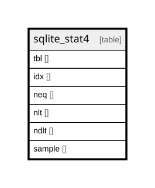

# sqlite_stat4

## Description

<details>
<summary><strong>Table Definition</strong></summary>

```sql
CREATE TABLE sqlite_stat4(tbl,idx,neq,nlt,ndlt,sample)
```

</details>

## Columns

| Name   | Type | Default | Nullable | Children | Parents | Comment |
| ------ | ---- | ------- | -------- | -------- | ------- | ------- |
| tbl    |      |         | true     |          |         |         |
| idx    |      |         | true     |          |         |         |
| neq    |      |         | true     |          |         |         |
| nlt    |      |         | true     |          |         |         |
| ndlt   |      |         | true     |          |         |         |
| sample |      |         | true     |          |         |         |

## Relations



---

> Generated by [tbls](https://github.com/k1LoW/tbls)
