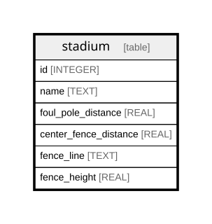

# stadium

## Description

<details>
<summary><strong>Table Definition</strong></summary>

```sql
CREATE TABLE stadium (
    id INTEGER PRIMARY KEY,
    name TEXT NOT NULL,
    foul_pole_distance REAL NOT NULL,
    center_fence_distance REAL NOT NULL,
    fence_line TEXT,
    fence_height REAL NOT NULL
)
```

</details>

## Columns

| Name                  | Type    | Default | Nullable | Children | Parents | Comment |
| --------------------- | ------- | ------- | -------- | -------- | ------- | ------- |
| id                    | INTEGER |         | true     |          |         |         |
| name                  | TEXT    |         | false    |          |         |         |
| foul_pole_distance    | REAL    |         | false    |          |         |         |
| center_fence_distance | REAL    |         | false    |          |         |         |
| fence_line            | TEXT    |         | true     |          |         |         |
| fence_height          | REAL    |         | false    |          |         |         |

## Constraints

| Name | Type        | Definition       |
| ---- | ----------- | ---------------- |
| id   | PRIMARY KEY | PRIMARY KEY (id) |

## Relations



---

> Generated by [tbls](https://github.com/k1LoW/tbls)
