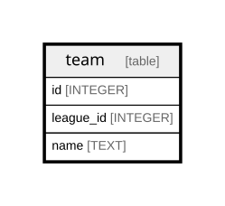

# team

## Description

<details>
<summary><strong>Table Definition</strong></summary>

```sql
CREATE TABLE team (id INTEGER PRIMARY KEY, league_id INTEGER NOT NULL, name TEXT NOT NULL)
```

</details>

## Columns

| Name      | Type    | Default | Nullable | Children | Parents | Comment |
| --------- | ------- | ------- | -------- | -------- | ------- | ------- |
| id        | INTEGER |         | true     |          |         |         |
| league_id | INTEGER |         | false    |          |         |         |
| name      | TEXT    |         | false    |          |         |         |

## Constraints

| Name | Type        | Definition       |
| ---- | ----------- | ---------------- |
| id   | PRIMARY KEY | PRIMARY KEY (id) |

## Relations



---

> Generated by [tbls](https://github.com/k1LoW/tbls)
