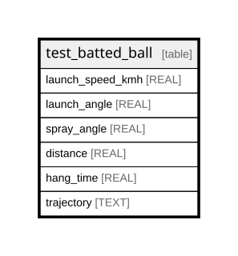

# test_batted_ball

## Description

<details>
<summary><strong>Table Definition</strong></summary>

```sql
CREATE TABLE test_batted_ball (
    launch_speed_kmh REAL NOT NULL,
    launch_angle REAL NOT NULL,
    spray_angle REAL NOT NULL,
    distance REAL NOT NULL,
    hang_time REAL NOT NULL,
    trajectory TEXT NOT NULL
)
```

</details>

## Columns

| Name             | Type | Default | Nullable | Children | Parents | Comment |
| ---------------- | ---- | ------- | -------- | -------- | ------- | ------- |
| launch_speed_kmh | REAL |         | false    |          |         |         |
| launch_angle     | REAL |         | false    |          |         |         |
| spray_angle      | REAL |         | false    |          |         |         |
| distance         | REAL |         | false    |          |         |         |
| hang_time        | REAL |         | false    |          |         |         |
| trajectory       | TEXT |         | false    |          |         |         |

## Relations



---

> Generated by [tbls](https://github.com/k1LoW/tbls)
