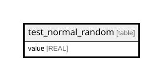

# test_normal_random

## Description

<details>
<summary><strong>Table Definition</strong></summary>

```sql
CREATE TABLE test_normal_random (value REAL NOT NULL)
```

</details>

## Columns

| Name  | Type | Default | Nullable | Children | Parents | Comment |
| ----- | ---- | ------- | -------- | -------- | ------- | ------- |
| value | REAL |         | false    |          |         |         |

## Relations



---

> Generated by [tbls](https://github.com/k1LoW/tbls)
