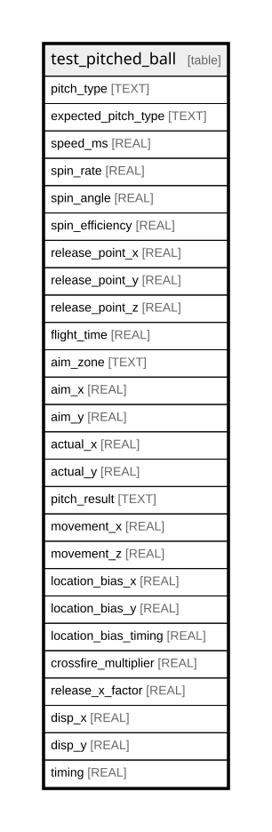

# test_pitched_ball

## Description

<details>
<summary><strong>Table Definition</strong></summary>

```sql
CREATE TABLE test_pitched_ball (
    pitch_type TEXT NOT NULL,
    expected_pitch_type TEXT NOT NULL,
    speed_ms REAL NOT NULL,
    spin_rate REAL NOT NULL,
    spin_angle REAL NOT NULL,
    spin_efficiency REAL NOT NULL,
    release_point_x REAL NOT NULL,
    release_point_y REAL NOT NULL,
    release_point_z REAL NOT NULL,
    flight_time REAL NOT NULL,
    aim_zone TEXT NOT NULL,
    aim_x REAL NOT NULL,
    aim_y REAL NOT NULL,
    actual_x REAL NOT NULL,
    actual_y REAL NOT NULL,
    pitch_result TEXT NOT NULL,
    movement_x REAL NOT NULL,
    movement_z REAL NOT NULL,
    location_bias_x REAL NOT NULL,
    location_bias_y REAL NOT NULL,
    location_bias_timing REAL NOT NULL,
    crossfire_multiplier REAL NOT NULL,
    release_x_factor REAL NOT NULL,
    disp_x REAL NOT NULL,
    disp_y REAL NOT NULL,
    timing REAL NOT NULL
)
```

</details>

## Columns

| Name                 | Type | Default | Nullable | Children | Parents | Comment |
| -------------------- | ---- | ------- | -------- | -------- | ------- | ------- |
| pitch_type           | TEXT |         | false    |          |         |         |
| expected_pitch_type  | TEXT |         | false    |          |         |         |
| speed_ms             | REAL |         | false    |          |         |         |
| spin_rate            | REAL |         | false    |          |         |         |
| spin_angle           | REAL |         | false    |          |         |         |
| spin_efficiency      | REAL |         | false    |          |         |         |
| release_point_x      | REAL |         | false    |          |         |         |
| release_point_y      | REAL |         | false    |          |         |         |
| release_point_z      | REAL |         | false    |          |         |         |
| flight_time          | REAL |         | false    |          |         |         |
| aim_zone             | TEXT |         | false    |          |         |         |
| aim_x                | REAL |         | false    |          |         |         |
| aim_y                | REAL |         | false    |          |         |         |
| actual_x             | REAL |         | false    |          |         |         |
| actual_y             | REAL |         | false    |          |         |         |
| pitch_result         | TEXT |         | false    |          |         |         |
| movement_x           | REAL |         | false    |          |         |         |
| movement_z           | REAL |         | false    |          |         |         |
| location_bias_x      | REAL |         | false    |          |         |         |
| location_bias_y      | REAL |         | false    |          |         |         |
| location_bias_timing | REAL |         | false    |          |         |         |
| crossfire_multiplier | REAL |         | false    |          |         |         |
| release_x_factor     | REAL |         | false    |          |         |         |
| disp_x               | REAL |         | false    |          |         |         |
| disp_y               | REAL |         | false    |          |         |         |
| timing               | REAL |         | false    |          |         |         |

## Relations



---

> Generated by [tbls](https://github.com/k1LoW/tbls)
