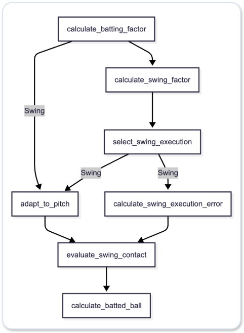

# Batting Logic

# Batting Process Flow

# 1. calculate_batting_factor

Calculates modifiers for calculate_swing_factor and adapt_to_pitch.

$$\text{total\_batting\_modifier} = \frac{(1.0 - \text{zone\_aptitude}) + (1.0 - \text{zone\_similarity}) + (1.0 - \text{pitch\_similarity})}{3.0}$$

## 1.1 distance_from_zone_edge

Calculates the ball's distance from the edge of the strike zone, $(0,0)$.

## 1.2 calculate_zone_similarity_factor

Calculates the pitch's strike-zone similarity.

- Center as predicted: +0.3
- Actual location is center, but different from the prediction: +0.1
- Both outside/inside and high/low match the prediction: +0.2
- Either outside/inside or high/low matches the prediction: +0.05
- Actual location is diagonal from the prediction: -0.2

## 1.3 calculate_pitch_similarity

Calculates pitch-type similarity.

- Spin-rate similarity
  - $\text{spin\_rate\_similarity} = 0.2 - (\text{actual\_spin\_rate} - \text{expected\_spin\_rate})$
- Spin-angle similarity
  - $\text{spin\_angle\_similarity} = 0.2 - \frac{\text{actual\_spin\_angle} - \text{expected\_spin\_angle}}{360}$
- Pitch-type similarity
  - $\text{pitch\_rate\_similarity} = \text{spin\_angle\_similarity} - \text{spin\_angle\_similarity}$
    - Maximum value: 0.2
    - Minimum value: -0.2

## 1.4 zone_modifier

Adjusts for the batter's strengths and weaknesses by strike-zone location.

$$\text{zone\_modifier} = \text{zone\_aptitude} \cdot (1.0 + \text{hot\_zone\_scale})$$

# 2. adapt_to_pitch

- Adjust spatial offsets
  - $\text{adapted\_}X_m = \text{offset\_}X_m \cdot \text{total\_modifier}$
  - $\text{adapted\_}X_z = \text{offset\_}Z_m \cdot \text{total\_modifier}$

- Adjust timing offset
  - $\text{adapted\_timing} = \text{offset\_timing} \cdot \text{total\_modifier}$

# 3. calculate_swing_factor

**1. Count-state factor**

| Balls | Strikes | Factor |
| ----: | ----: | ----: |
| 0 | 0 | 0.0 |
| 1 | 0 | -0.1 |
| 2 | 0 | 0.25 |
| 0 | 1 | 0.1 |
| 1 | 1 | 0.0 |
| 2 | 1 | -0.1 |
| 3 | 1 | -0.25 |
| 0 | 2 | 0.2 |
| 1 | 2 | 0.1 |
| 2 | 2 | 0.05 |
| 3 | 2 | 0.15 |

**2. Batter approach factor (added only with 2 strikes)**

| Batting Approach | Factor |
| ---- | ----: |
| Aggressive | 0.2 |
| Patient | -0.1 |
| Take | -0.5 |

**3. Pitch-type factor**

- Fastball: +0.1
- Non-fastball: -0.05

**4. Sum of $\text{swing\_factor}$**

$$\text{swing\_factor} = \text{count\_status\_factor} + \text{fastball\_factor}  + \text{distance\_from\_zone\_edge\_factor} \text{zone\_similarity\_factor} + \text{pitch\_similarity\_factor}  + \text{zone\_aptitude\_factor}$$

# 4. select_swing_execution

Swing if the random value is less than $\text{swing\_factor}$; take the pitch if it is greater than or equal to $\text{swing\_factor}$.

# 5. calculate_swing_execution_error

- Determine the bat tilt angle.
- Determine the swing attack angle.
- Determine additional spatial offsets.
  - Add the pitch's physical gap ($gap$) and the swing error caused by the batter's form breakdown ($execution_error$).

$$\text{Final } x_m = \text{gap.spatial\_x\_m} + \text{timing\_impact\_x\_m} + \text{execution\_error.additional\_x\_m}$$
$$\text{Final } z_m = \text{gap.spatial\_z\_m} + \text{execution\_error.additional\_z\_m}$$

## 5.1 calculate_bat_angle

$$\text{bat\_angle\_deg} = \text{CENTER\_ANGLE\_DEG} - (\text{ball\_location\_y} * \text{HIGH\_LOW\_RANGE\_DEG})$$

- $\text{CENTER\_ANGLE\_DEG} = 30^\circ$ (standard bat tilt angle for the center of the strike zone)
- $\text{ball\_location\_y} = +1.0 ~ -1.0$ (ball height)
- $\text{HIGH\_LOW\_RANGE\_DEG} = 15^\circ$ (amount of bat tilt angle variation caused by ball height)
- Maximum value: 60 degrees
- Minimum value: 10 degrees

## 5.2 calculate_dynamic_attack_angle

$$\text{attack\_angle\_deg} = \text{BatterInfo.attack\_angle} + ((\text{bat\_angle\_deg} - \text{BASE\_BAT\_ANGLE\_DEG}) * \text{COUPLING\_FACTOR})$$

- $\text{BASE\_BAT\_ANGLE\_DEG} = 30^\circ$ (standard bat tilt angle)
- $\text{COUPLING\_FACTOR} = 0.35$ (correlation coefficient between bat tilt angle and swing attack angle)

# 6. evaluate_swing_contact

- If the contact point exceeds the bat length (distance from the sweet spot to the end of the bat along the length direction: 0.35 m), SwungAndMiss.
- If the contact point exceeds the bat thickness (distance from the sweet spot to the edge of the bat along the thickness direction: 0.07 m), SwungAndMiss.
- If the thickness-direction distance from the sweet spot to the edge of the bat is greater than 0.055 m, FoulTip.
- If the thickness-direction distance from the sweet spot to the edge of the bat is greater than 0.025 m, WeakContact.
- If the thickness-direction distance from the sweet spot to the edge of the bat is greater than 0.025 m, SolidContact.

# 7. calculate_batted_ball

Collects the batted-ball calculation results into BattedBall.

## 7.1 calculate_collision_spin

1. Calculate the bat-ball collision point and the distance from the bat's sweet spot.
2. Calculate the spin angle from the collision-point angle.
3. Calculate the spin rate.
$$\text{raw\_spin\_rate} = \text{MAX\_COLLISION\_SPIN\_AT\_REF\_SPEED} * \frac{\text{swing\_speed}}{\text{REF\_SWING\_SPEED}}$$
- $\text{REF\_SWING\_SPEED} = 33.333$ (standard swing speed in m/s)
- $\text{MAX\_COLLISION\_SPIN\_AT\_REF\_SPEED} = 4000$ (maximum spin rate at the standard swing speed)
1. Combine with the pitch vector in combine_batted_spin.

## 7.2 combine_batted_spin

1. Multiply the pitch spin rate by $\text{retention\_rate}$ to calculate the spin rate added to the batted ball.
2. Add the pitch vector and the ball-bat collision vector to calculate the batted-ball vector.

## 7.3 calculate_effective_c_swing

The batter power value that affects batted-ball acceleration.

$$\text{effective\_}C_{\text{swing}} = \begin{cases} C_{\text{swing}} \cdot (1.0 + \frac{X_m}{0.2} \cdot 0.05) & (X_m < 0.0) \\ C_{\text{swing}} \cdot (1.0 - \frac{X_m}{0.2} \cdot 0.15) & (X_m \ge 0.0) \end{cases}$$

## 7.4 calculate_launch_speed_with_power

1. Calculate the maximum acceleration when the ball is hit perfectly on the bat's sweet spot.
$$\text{c\_swing} = 1.12 + (0.16 \cdot power)$$
- $power$ (batter power value from calculate_effective_c_swing)
$$\text{max\_launch\_speed} = (\text{C\_PITCH} * \text{ball\_speed}) + (\text{c\_swing} * \text{swing\_speed})$$
- $\text{C\_PITCH}$ (contribution rate of pitch speed to batted-ball speed)

2. Calculate the attenuation rate based on the thickness-direction distance from the bat's sweet spot.
$$\text{e\_thick} = \begin{cases} 1.0 & (Y_m \le \text{SWEET\_SPOT\_RADIUS}) \\ 0.0 & (Y_m \ge \text{MAX\_CONTACT\_RADIUS}) \\ \frac{Y_m - \text{SWEET\_SPOT\_RADIUS}}{\text{MAX\_CONTACT\_RADIUS} - \text{SWEET\_SPOT\_RADIUS}} & (Y_m > \text{SWEET\_SPOT\_RADIUS} \quad \& \quad Y_m < \text{MAX\_CONTACT\_RADIUS})\end{cases}$$
- $\text{SWEET\_SPOT\_RADIUS} = 0.02$ (sweet-spot range)
- $\text{MAX\_CONTACT\_RADIUS} = 0.07$ (contact range along the bat thickness direction)

3. Calculate the attenuation rate based on the length-direction distance from the bat's sweet spot.

$$\text{e\_len} = 1.0 - (X_m / \text{MAX\_LENGTH\_OFFSET})^2$$
- $\text{MAX\_LENGTH\_OFFSET} = 0.35$ (contact range along the bat length direction)

4. Calculate batted-ball acceleration.

$$\text{launch\_speed} = \text{max\_launch\_speed} \cdot \text{e\_thick} \cdot \text{e\_len}$$

## 7.5 calculate_launch_angles

1. Calculate the vertical launch angle.
$$\text{vla\_deg} = \text{attack\_angle\_deg} + (\text{normal\_angle\_z} * \text{VLA\_REBOUND\_FACTOR})$$
- $\text{attack\_angle\_deg}$ (swing attack angle)
- $\text{normal\_angle\_z}$ (coefficient based on deviation from the bat's sweet spot)
- $\text{VLA\_REBOUND\_FACTOR}$ (coefficient based on ball deformation at collision)

2. Calculate the horizontal launch angle.
$$\text{hla\_deg} = (\text{face\_angle\_rad} * \text{HLA\_FACE\_FACTOR}) + (\text{rebound\_angle\_x} * \text{HLA\_REBOUND\_FACTOR})$$

- $\text{face\_angle\_rad}$ (angle caused by bat rotation)
- $\text{HLA\_FACE\_FACTOR}$ (contribution rate of $\text{face\_angle\_rad}$ to the horizontal launch angle)
- $\text{rebound\_angle\_x}$ (angle caused by bat-ball rebound)
- $\text{HLA\_REBOUND\_FACTOR}$ (contribution rate of $\text{rebound\_angle\_x}$ to the horizontal launch angle)

## 7.6 calculate_trajectory

1. Loop and calculate Magnus acceleration until the spin rate is less than 10 or the batted-ball speed is less than $0.1m/s^2$.
$$a_{\text{magnus}} = \text{MAGNUS\_COEFF} \cdot v_{\text{rel}} \cdot S_{\text{rpm}}$$
- $\text{MAGNUS\_COEFF} = 0.0000336$: Magnus-effect coefficient assuming a ball speed of 150 km/h and a spin rate of 2500 rpm
- $v_{\text{rel}}$: batted-ball air-relative velocity
- $S_{\text{rpm}}$: batted-ball spin rate
2. Determine whether the ball reaches the stands or rebounds off the fence.
- Adjust acceleration
  - $v_x = -v_x \cdot \text{WALL\_RESTITUTION}$
    - $\text{WALL\_RESTITUTION} = 0.6$: fence restitution coefficient
1. For a ground ball, continue bounce processing in a loop until horizontal velocity is less than $0.2m/s^2$.
- Adjust acceleration
  - $v_z = -v_z \cdot \text{RESTITUTION\_COEFF}$
    - $\text{RESTITUTION\_COEFF}$: ground restitution coefficient
  - $v_x = v_x \cdot (1.0 - \text{GROUND\_FRICTION})$
  - $v_y = v_y \cdot (1.0 - \text{GROUND\_FRICTION})$
    - $\text{GROUND\_FRICTION}$: ground friction coefficient
