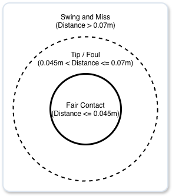
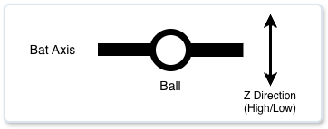
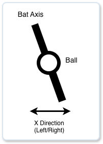
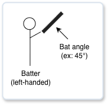
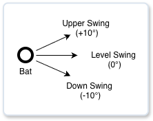
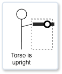
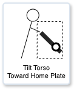

# Spatial Coordinates of the Stadium

The game uses polar coordinates.

**(flight distance $R$, horizontal angle $\theta$)**

# Batted-Ball Physics

### Velocity Basics

$$V_{solid} \approx a \cdot V_{pitch} + b \cdot V_{swing}$$
- $V_{solid}$: batted-ball velocity
- $V_{pitch}$: pitch velocity
- $V_{swing}$: swing velocity
- $a, b$: constants determined by factors such as the coefficient of restitution. In general, $b$ is much larger.

### Effect of Spin Direction
- Backspin
  - Produces a fly ball that carries farther without losing speed as quickly.
- Topspin
  - Creates a driving trajectory that loses altitude quickly and becomes a ground ball.
- Sidespin
  - Produces a drive that slices toward foul territory.
- Gyro spin
  - Produces little carry and loses speed quickly.

### Effect of Spin Rate (rpm)
- High spin rate
  - Increases hang time and greatly extends flight distance.
- Low spin rate
  - The ball can wobble irregularly due to air resistance and lose speed.

### Examples of Spin Direction and Spin Rate Effects

| Spin direction | Spin rate | Behavior | Effect on speed and distance |
| ---- | ---- | ---- | ---- |
| Backspin | High | Ideal home-run trajectory | Initial velocity is maintained, and hang time is maximized. |
| Backspin | Low | Line-drive type / dying fly ball | The ball does not carry and drops after losing speed. |
| Topspin | High | Hard driving ground ball | Even with high batted-ball velocity, the ball dives into the ground almost immediately. |
| Sidespin | High | Slicing foul liner | The ball bends sharply sideways, making it difficult to keep in fair territory. |

### How Batters Use Spin

By contacting the lower half of the ball and applying clean backspin at a high spin rate, the batter can maximize the Magnus effect and increase flight distance.

### Offset from the Bat's Sweet Spot at Impact

Represented as a two-dimensional polar-coordinate vector.

- Offset magnitude $d$ (distance): 0.0 (perfect sweet-spot contact) to 1.0 (edge of the bat)
- Offset direction $\theta$ (angle): the direction of the contact point on the bat as seen from the center of the ball (0° to 360°)

### Causes of Offset

The batter predicts the pitch trajectory until it reaches the catcher's mitt based on the pitcher's release, pitch velocity, and memory of previous pitch movement.
If the trajectory matches the prediction, assume the batter can adjust the swing path to the ball's movement and square it up on the sweet spot.
(Mishits are considered separately.)

### Prediction Error

$$\text{Difficulty} = \Vert{}\vec{M}_{\text{actual}} - \vec{M}_{\text{expected}}\Vert{}$$

- Baseline predicted point (default fastball image): $\vec{M}_{\text{expected}}$
- Actual physical movement of the pitch: $\vec{M}_{\text{actual}}$

### Causes of Error

**Batter Perception**

- Pitch tunneling (example: forkball)
  - The pitch follows the same trajectory as a fastball until partway through, then changes sharply. This creates a gap from the prediction after the batter has already started swinging.
- Rising illusion (example: high-spin fastball)
  - If a fastball that should drop 30 cm due to gravity drops only 15 cm because of strong lift, the batter perceives it as rising by 15 cm.
- Sinking illusion (example: low-spin fastball)
  - If a fastball that should drop 30 cm due to gravity drops 45 cm because there is no lift, the batter perceives it as sinking by 15 cm.

**Ball Characteristics**

- Amount of movement (example: sharply breaking slider)
  - If the movement is too large, the three-dimensional intersection between the swing path and ball path (the impact zone) becomes narrower.

**Pitcher Release Point**

- Reduced batter reaction time from stride distance off the plate
  - Perceived velocity calculation. If a pitcher releases the ball 2.1 m in front of the plate, an actual 150 km/h pitch is perceived as 154 km/h.
$$\text{perceived\_speed} = \text{speed} \times \left( \frac{\text{standard pitcher-batter distance}}{\text{actual release-batter distance}} \right)$$

- Low release point
  - With a sidearm or submarine delivery, the approach angle becomes flatter, making the same pitch appear to rise relative to the batter's eye line.
- Crossfire
  - When a left-handed pitcher throws from the extreme third-base side of the rubber to the inside corner against a right-handed batter, the horizontal approach angle becomes steep, creating the illusion that the ball is coming from behind the batter's back.

### Combining Pitch Spin and Batted-Ball Collision Spin

Decompose the spin angle into an $X$ component (sidespin) and a $Y$ component (vertical spin), then add them separately.

**$Y$ component (vertical spin):**
$$\text{spin\_y} = \text{spin\_rate} \cdot \cos(\text{spin\_dir})$$
  - $+Y$: backspin (lift)
  - $-Y$: topspin (drop)

**$X$ component (sidespin):**
$$\text{spin\_x} = \text{spin\_rate} \cdot \sin(\text{spin\_dir})$$
  - $+X$: slider spin (breaks right)
  - $-X$: shuuto/two-seam spin (breaks left)

**Examples of Combination**

1. Hitting the lower half of a fastball
   - Collision spin: backspin component ($+Y$)
   - Pitch spin: fastball backspin component ($+Y$)
   - Result: the $+Y$ components add together, increasing the batted ball's backspin and flight distance.

2. Hitting the lower half of a curveball
   - Collision spin: the batter tries to lift it by applying a backspin component ($+Y$).
   - Pitch spin: curveball topspin component ($-Y$) remains.
   - Result: $+Y$ and $-Y$ cancel each other out. Even though the ball is lifted, it has little backspin and does not carry.
  
3. Hitting a cutter
   - Collision spin: the batter tries to hit it up the middle with mostly vertical spin ($X=0$).
   - Pitch spin: cutter sidespin component ($+X$ or $-X$)
   - Result: a horizontal sidespin component remains, causing a liner that appeared squared up to slice toward foul territory.

### Batted-Ball Spin Axis

The spin direction of the batted ball relative to the collision point $\theta$ is $\theta + 180^\circ$ (the opposite direction).

| Bat contact point ($\theta$) | Batted-ball direction | Batted-ball spin | Batted-ball behavior |
| ---- | ---- | ---- | ---- |
| Bottom side (180° / 6 o'clock) | Up | Backspin (0° / 12 o'clock) | Fly ball that carries with initial lift |
| Top side (0° / 12 o'clock) | Down | Topspin (180° / 6 o'clock) | Ground ball with driving topspin |
| Right side (90° / 3 o'clock) | Left | Shuuto spin (270° / 9 o'clock) | Liner that slices left (pulled by a right-handed batter) |
| Left side (270° / 9 o'clock) | Right | Slider spin (90° / 3 o'clock) | Liner that slices right (opposite-field by a right-handed batter) |

### Batted-Ball Spin Rate

$$\text{generated\_spin\_rate} = \text{MAX\_SPIN} \times d \times V_{\text{swing\_impact}}$$

1. Offset magnitude $d$: if the ball is struck on the sweet spot ($d=0$), spin is close to zero; the larger $d$ is, the higher the spin rate becomes.
2. Swing velocity ($\text{swing\_impact}$): the faster the swing brushes the ball, the stronger the spin.
3. Efficiency tradeoff: as $d$ increases, spin rate rises but batted-ball velocity drops.

### Launch Angle and Spin Angle by Batted-Ball Type

| Batted-ball type | Launch angle | Spin angle | Spin rate | Spin-driven trajectory characteristics |
| ---- | ---- | ---- | ---- | ---- |
| Ground ball | Under 10° | 120° to 180° | 1,000 to 2,500 rpm | Driven into the ground and bounces. |
| Liner 1 | 10° to 25° | 0° to 15° | 2,000 to 2,800 rpm | Carries and is likely to clear the outfielders. |
| Liner 2 | 10° to 25° | 15° to 45° | 1,500 to 2,000 rpm | Loses speed and tends to sink. |
| Fly ball | 25° to 50° | 0° to 30° | 2,000 to 3,200 rpm | The Magnus effect increases hang time, making home runs more likely. |
| Popup | 50° or more | Around 0° | 3,500 to 5,000+ rpm | Goes almost straight up and comes down. |

### Effective Acceleration with the Magnus Effect

In the projectile-motion equation, replace $g$ (gravity, 9.81) with $g_{eff}$ (effective gravitational acceleration), which includes lift and gravity correction from spin.

$$g_{eff} = g - a_{magnus} \cdot \cos(\text{spin\_dir})$$
$$a_{magnus} \approx C \cdot \text{spin\_rate} \cdot v$$

- Backspin: upward force reduces the gravity experienced by the ball ($g_{eff} < g$).
- Topspin: downward force increases the gravity experienced by the ball ($g_{eff} > g$).

### Initial Value of the Horizontal Launch Angle (Initial Velocity Vector)

Determined by the instant of bat-ball collision (timing gap).

- Right-handed batter pulling the ball (early timing): $-X$ (toward left field)
- Right-handed batter going opposite field (late timing): $+X$ (toward right field)
- Left-handed batter pulling the ball (early timing): $+X$ (toward right field)
- Left-handed batter going opposite field (late timing): $-X$ (toward left field)

### Effect of Sidespin Component (X Acceleration from Spin)

Extract the sidespin component (force that bends the ball left or right) from the batted-ball spin angle.

**Examples**
- Spin angle = 90° (3:00 / slider spin): bends rightward ($+X$).
- Spin angle = 270° (9:00 / shuuto or slice spin): bends leftward ($-X$).

### Final Horizontal Launch Angle

$$\text{spray\_angle} = \underbrace{\text{HLA}_{\text{initial}}}_{\text{1. initial launch angle}} + \underbrace{\Delta \theta_{\text{side\_spin}}}_{\text{2. in-flight bend from sidespin}}$$

1. Initial launch angle ($\text{HLA}_{\text{initial}}$): the horizontal launch angle determined by the timing gap at impact.
2. Sidespin bend ($\Delta \theta_{\text{side\_spin}}$): the angle turned by acceleration in the X direction from slider or shuuto spin.

$$x_{\text{side}} = \frac{1}{2} \cdot a_{\text{side}} \cdot t^2$$
$$\Delta \theta_{\text{side\_spin}} = \text{atan2}(x_{\text{side}}, \text{distance\_y})$$

### Calculating the Final X Coordinate of the Batted Ball

The final X coordinate of the batted ball is calculated by adding linear motion from initial velocity and quadratic bending from sidespin.

$$X_{\text{final}} = \underbrace{V_{\text{horizontal}} \cdot \sin(\text{HLA}) \cdot \text{time}}_{\text{1. linear movement}} \;+\; \underbrace{\frac{1}{2} \cdot a_{\text{side}} \cdot \text{time}^2}_{\text{2. sidespin bend}}$$

The X acceleration from sidespin, $a_{\text{side}}$, is calculated from the $\sin$ component of the spin direction.

$$a_{\text{side}} = a_{\text{magnus}} \cdot \sin(\text{spin\_dir})$$

Because sidespin bend is constant-acceleration motion, its effect becomes larger for high fly balls with long hang time.

### Examples of Batted-Ball Behavior

1. Foul fly ball slicing toward foul territory
- Right-handed batter going opposite field: horizontal launch angle = +20°, spin angle = 90°
- Behavior: immediately after launch, the ball heads toward foul ground on the right, then bends farther right during flight and lands in the foul-territory seats.

2. Liner that drives and slices into foul ground
- Right-handed batter pulling the ball: horizontal launch angle = -30°
- Behavior: as time passes, the bend toward foul ground on the left is amplified, and the ball crosses the third-base/left-field line into foul territory.

3. Carrying liner through right-center or left-center
- With clean backspin, the X acceleration from sidespin is close to $0$, so the ball travels almost straight at the horizontal launch angle without losing much batted-ball velocity, resulting in an extra-base hit.

### Calculating Vertical Launch Angle

- Each batter has a base launch angle.
- The angle is adjusted based on the contact state with the ball at impact.

**Example**

| Contact state | Angle adjustment | Base launch angle | Launch angle | Batted-ball type |
| ---- | ----: | ----: | ----: | ---- |
| Hit the top of the ball | -30° | 28° | 2° | Ground ball |
| Hit slightly above the ball center | -15° | 28° | 13° | Low liner |
| Squared it up | 0° | 28° | 28° | Extra-base trajectory (fly ball / liner) |
| Hit slightly below the ball center | +15° | 28° | 43° | Fly ball |
| Hit the bottom of the ball | +30° | 28° | 58° | Popup |

### Effective Contact Radius of the Bat

### Differences in Physical Behavior by Bat Angle

- Define the bat angle as $\theta_{\text{bat}}$.
  - Horizontal: $0^\circ$
  - Vertical direction with the grip down and barrel up: $90^\circ$

#### 1. Nearly Horizontal Swing ($\theta_{\text{bat}} ≈ 0^\circ$)

- Characteristics: the bat extends in the $X$ direction, and the bat diameter points in the $Z$ direction.
- Physical behavior: the bat length provides wide coverage in the $X$ direction, but in the $Z$ direction, missing the bat diameter (about 6.6 cm) results in a swing and miss.

#### 2. Nearly Vertical Swing ($\theta_{\text{bat}} ≈ 60^\circ to 80^\circ$)

- Characteristics: the bat extends in the $Z$ direction, and the bat diameter points in the $X$ direction.
- Physical behavior: part of the bat length is projected to cover the $Z$ direction. Conversely, the coverage in the $X$ direction becomes shorter.

### Calculating Distance from the Bat's Sweet Spot

Convert the spatial offset $(X, Z)$ into distance $N$ ($\text{m}$).

$$N = -X \cdot \sin(\theta_{\text{bat}}) + Z \cdot \cos(\theta_{\text{bat}})$$

- If $\theta_{\text{bat}} = 0^\circ$:
  - $N = Z$. The vertical offset $Z$ directly becomes the offset in the bat's thickness direction.
- If $\theta_{\text{bat}} = 90^\circ$:
  - $N = -X$. The inside/outside offset $X$ directly becomes the offset in the bat's thickness direction.

### Differences in Bat Angle by Pitch Location

- Inside pitch: $\theta_{\text{bat}}$ becomes larger.
- Outside pitch: $\theta_{\text{bat}}$ becomes smaller.
- High pitch: $\theta_{\text{bat}}$ becomes smaller.
- Low pitch: $\theta_{\text{bat}}$ becomes larger.

### Physical Calculation Model for Vertical Launch Angle

Calculate the angle by adding the rebound-angle deflection caused by vertical offset $z_m$ against the bat's cylindrical surface to the base swing attack angle.

- Effective collision radius ($R_{\text{eff}}$):
  - Bat radius $R_{\text{bat}} \approx 0.033\text{m}$ ($3.3\text{cm}$) + ball radius $R_{\text{ball}} \approx 0.037\text{m}$ ($3.7\text{cm}$) $= \mathbf{0.070\text{m}}$ ($7.0\text{cm}$).
- Normal collision angle ($\phi_z$):
$$\phi_z = \arcsin\left( \frac{z_m}{R_{\text{eff}}} \right) \quad (\text{where } \vert{}z_m\vert{} \le R_{\text{eff}})$$
  - $z_m$: vertical offset between the bat center and ball center

- Formula for vertical launch angle (VLA):
$$\text{VLA} = \theta_{\text{attack}} + \text{degrees}(\phi_z) \cdot k_{\text{vla\_rebound}}$$
  - $\theta_{\text{attack}}$: batter's swing attack angle
    - Uppercut swing: $+10^\circ \sim +15^\circ$
    - Level swing: $0^\circ \sim +5^\circ$
  - $k_{\text{vla\_rebound}}$: rebound deflection coefficient from bat elasticity and friction (roughly $0.5 \sim 0.7$)
    - Because the ball deforms instead of colliding as a rigid body, the rebound is pulled toward the swing path rather than following the exact normal direction.

### Physical Calculation Model for Horizontal Launch Angle

Calculate this by combining the bat face angle in swing rotation with rebound from the curved cross-section of the bat.

#### Bat Face Angle Tilt ($\phi_{\text{face}}$):
$$\phi_{\text{face}} = \arcsin\left( \frac{x_m}{L_{\text{arm}}} \right)$$
- $x_m$: bat impact position combining timing delay/early swing and spatial inside/outside offset
  - $x_m < 0$ (impact point is out front)
    - The bat face points left, toward the pull side for a right-handed batter.
  - $x_m > 0$ (impact point is deeper)
    - The bat face points right, toward the opposite field for a right-handed batter.
- $\phi_{\text{face}}$: bat orientation when the contact point is offset forward/backward by $x_m$
- Swing rotation radius around the batter's torso/shoulders: $L_{\text{arm}} \approx 1.1\text{m}$

#### Lateral Curved-Surface Rebound ($\phi_{\text{rebound}}$):

As with the vertical direction, rebound-angle deflection from the horizontal offset $x_m$ against the bat's lateral cylindrical surface is also added.

$$\phi_{\text{rebound}} = \arcsin\left( \frac{x_m}{R_{\text{eff}}} \right)$$

- Formula for horizontal launch angle (HLA):
$$\text{HLA} = \text{BaseSprayAngle} + \text{degrees}(\phi_{\text{face}}) \cdot k_{\text{face}} + \text{degrees}(\phi_{\text{rebound}}) \cdot k_{\text{rebound}}$$

- $k_{\text{face}}$: contribution of face angle ($0.8 \sim 1.0$; timing gap is the main factor in launch direction)
- $k_{\text{rebound}}$: contribution of lateral curved-surface rebound ($0.2 \sim 0.3$; outward rebound when contact is near the barrel end or handle)

### Behavior Under the Physical Calculation Model

- If the ball is struck on the true sweet spot ($x_m=0.0$, $z_m=0.0$):
  - $\text{VLA} = \theta_{\text{attack}}$: an ideal liner following the swing attack angle directly
  - $\text{HLA} = 0^\circ$: hit back up the middle
- If the lower half of the ball is struck ($z_m+0.035m$):
  - $\arcsin(0.035 / 0.070) = 30^\circ \times 0.6 = +18^\circ$ is added, producing a fly ball with a vertical launch angle of about $+28^\circ$.
- If the batter is late ($x_m+0.05m$):
  - The bat face opens by about $2.6^\circ$ ($\times 0.85$), plus curved-surface rebound of about $45.5^\circ$ ($\times 0.25$), for a total of approximately $+13.8^\circ$, sending the ball to the right.

### Basic Equation of Motion for Initial Batted-Ball Velocity

$$V_{\text{max}} = c_{\text{pitch}} \cdot V_{\text{pitch}} + c_{\text{swing}} \cdot V_{\text{swing}}$$

- $V_{\text{max}}$: maximum initial batted-ball velocity on perfect sweet-spot contact ($\text{m/s}$)
- $V_{\text{pitch}}$: pitch velocity ($\text{m/s}$)
- $V_{\text{swing}}$: bat swing velocity ($\text{m/s}$)
- $c_{\text{pitch}}$ (pitch-velocity rebound contribution): about $0.15 \sim 0.20$ (pitch velocity contributes roughly $15\sim 20\%$)
- $c_{\text{swing}}$ (swing-velocity contribution): about $1.15 \sim 1.25$ (most initial batted-ball velocity is determined by swing velocity)

### Reduction in Rebound Efficiency from Offset Distance to the Bat's Sweet Spot

If the impact point is offset from the bat's sweet spot, the ball not only contacts the bat obliquely and slips, but energy also escapes through bat flex and vibration, causing initial velocity to drop sharply.

The damping coefficient $E_{\text{contact}}$ ($0.0 \sim 1.0$) is calculated from two values: offset in the bat's thickness direction ($d_{\text{thick}}$) and offset in the bat's length direction ($d_{\text{len}}$).

#### 1. Thickness-Direction Damping ($E_{\text{thick}}$)

For the effective contact radius $R_{\text{eff}} = 0.070\text{m}$ (bat radius $3.3\text{cm}$ + ball radius $3.7\text{cm}$), maximum rebound is maintained up to $2\text{cm}$ ($0.020\text{m}$) from the sweet spot. Beyond that, apply a cosine-squared curve with a flat region that drops sharply.

$$E_{\text{thick}} = \begin{cases} 1.0 & (d_{\text{thick}} \le 0.020) \\ \cos^2\left( \frac{\pi}{2} \cdot \frac{d_{\text{thick}} - 0.020}{0.070 - 0.020} \right) & (0.020 < d_{\text{thick}} < 0.070) \\ 0.0 & (d_{\text{thick}} \ge 0.070) \end{cases}$$

#### 2. Length-Direction Damping ($E_{\text{len}}$)

Loss when contact misses the sweet spot toward the barrel end or handle side.

- Barrel-end side ($d_{\text{len\_tip}}$): although bat tangential velocity increases toward the barrel end, rebound efficiency decreases because the effective mass is lower.
- Handle side ($d_{\text{len\_root}}$): energy escapes more through bat flex, so rebound efficiency drops sharply.

#### Practical Calculation Example (150 km/h Fastball vs. 125 km/h Swing)

- Theoretical maximum initial velocity $V_{\text{max}}$:
$$150 \times 0.18 + 125 \times 1.20 = 27 + 150 = 177.0 \text{ km/h}$$
- Perfect sweet-spot hit ($d_{\text{thick}} \le 2.0\text{cm}$):
  - Rebound efficiency $100\%$ $\rightarrow$ $177.0 \text{ km/h}$ (clean hit / home-run contact)
- Slightly off the sweet spot ($d_{\text{thick}} = 3.5\text{cm}$):
  - Rebound efficiency $\approx 80\%$ $\rightarrow$ $141.6 \text{ km/h}$ (liner at a fielder / outfield fly ball)
- Severe jam shot / barrel-end graze ($d_{\text{thick}} = 5.5\text{cm}$):
  - Rebound efficiency $\approx 22\%$ $\rightarrow$ $38.9 \text{ km/h}$ (weak pitcher grounder / popup)

### Difference Between Bat Tilt Angle and Swing Attack Angle

| Parameter | Bat tilt angle | Swing attack angle |
| ---- | ---- | ---- |
| Viewing perspective | Angle seen from in front of the pitcher | Angle seen from the dugout |
| Angle definition | How much the bat is tilted relative to the ground | How much the bat path is tilted upward or downward |
| Numerical baseline | 0° = perfectly horizontal / 90° = vertical | 0° = level / +10° = uppercut / -5° = downward |
| Purpose | How many cm away contact is from the bat's sweet spot | The angle at which the ball is hit back |

#### Bat Tilt Angle: View from in Front of the Pitcher

- The three-dimensional posture of the bat at the instant of impact.
- Used to decompose and convert spatial errors in $X$ (left/right) and $Z$ (up/down) into the bat cylinder's thickness direction and length direction.

#### Swing Attack Angle: View from the Dugout

- The physical vector of the swing path as the bat passes from back to front.
- When the ball is struck on the true sweet spot, the ball's launch angle directly becomes the vertical launch angle.

### Correlation Between Bat Tilt Angle and Swing Attack Angle

#### High-Pitch Swing (Small Bat Tilt Angle)

- High pitch (small bat tilt angle / around 20°):
  - Because the torso is close to upright, the bat's rotation plane is nearly parallel to the ground.
  - The swing attack angle becomes small (around $+3^\circ \sim +8^\circ$).

#### Low-Pitch Swing (Large Bat Tilt Angle)

- Low pitch (large bat tilt angle / 40° to 50°):
  - Because the batter rotates while leaning the torso substantially toward the plate, the bat path becomes strongly upward relative to the ground.
  - The swing attack angle becomes large (around $+15^\circ \sim +22^\circ$).

### Effect of Torque in Batting

- Bat-ball contact lasts only about 0.7 to 1.0 ms.
- The impulse from the batter's muscle force (force x time) is physically almost zero and does not directly affect the ball's rebound.

#### Physical Representation of a Power Hitter

- Large bat moment of inertia:
  - The batter can swing through with a heavier bat whose center of mass is closer to the barrel end, while still maintaining high swing speed.

- High effective mass at collision:
  - Against the impact of the ball, the batter can keep the bat from wobbling or rotating at the hands and turn the bat, arms, and torso into one combined effective mass.

#### Physical Representation of $C_{\text{SWING}}$ (Maximum Transfer Rate)

$$C_{\text{swing}} = \frac{M}{M + m} (1 + e)$$

- $C_{\text{swing}}$: momentum-transfer coefficient from bat to ball
- $M$: bat mass
- $m$: ball mass
- $e$: coefficient of restitution

#### Example Values of $C_{\text{SWING}}$

- Average hitter (light to standard bat / small effective mass): $C_{\text{SWING}} \approx 1.12 \sim 1.18$
- Power hitter (heavy bat / large effective mass): $C_{\text{SWING}} \approx 1.22 \sim 1.30$

#### Effect of Pulling the Ball on $C_{\text{SWING}}$

Even with the same swing speed, initial batted-ball velocity differs between pull-side and opposite-field contact.

**1. Transfer Through the Torso Kinetic Chain**

- Out front of the body ($x_m < 0$)
  - The ball is struck at the moment when torso rotation is completing and the body's force transfers most fully into the bat.
    - Effective mass $M_{\text{eff}}$ is maximized, improving $C_{\text{SWING}}$.
- Toward the catcher ($x_m > 0$)
  - Contact occurs before torso rotation has fully transferred into the bat, making the bat more likely to be overpowered by the ball's impact.
    - Effective mass $M_{\text{eff}}$ decreases, reducing $C_{\text{SWING}}$.

**2. Squareness of Collision (Force in the Normal Direction)**

- Pull side
  - Because the ball is struck squarely relative to the swing path, almost 100% of swing kinetic energy is converted into initial velocity.
- Opposite field
  - Because the ball is struck while the bat face is opened at an angle, some swing kinetic energy escapes into spin, reducing initial velocity.

### Batter Prediction and Offset Adjustment

#### Types of Prediction

- Location prediction: where in the strike zone the pitch will be thrown
- Pitch type and velocity prediction: whether it is a 150 km/h fastball or a 130 km/h forkball
- Release-point recognition: instantly identifying the initial trajectory from the pitcher's form

#### Batter Adjustment Mechanism

**1. Decision Time**

There is a threshold point after the pitcher releases the ball beyond which the batter can no longer adjust the swing midstream or decide to stop it.

- For a 150 km/h pitch (flight time about 0.40 s):
  - Time during which the batter can read the trajectory: about 0.22 to 0.24 s
  - Remaining time after swing start: about 0.16 s

Batters with better plate discipline and reaction speed can wait longer to identify the ball before starting or adjusting the swing.

**2. Adaptability**

Batters with high contact ability can keep the hand-position gap small even when their prediction is wrong.

$$\text{effective\_spatial\_gap} = \text{raw\_spatial\_gap} \times (1.0 - \text{batter\_adaptability})$$

When timing is disrupted, the batter can make fine timing adjustments at the cost of swing speed.

$$\text{effective\_timing\_gap} = \text{raw\_timing\_gap} \times (1.0 - \text{batter\_adaptability})$$
$$\text{effective\_swing\_speed} = \text{raw\_swing\_speed} \times (1.0 - \text{batter\_adaptability})$$

### Calculating the Final Position of the Batted Ball

#### Calculating Time Until First Bounce

Given initial velocity $v_z = v \cdot \sin(\text{VLA})$ and contact height $z_0$ (about $0.9\text{m}$), the time $t$ when landing height $z(t) = 0$ is calculated with the following equation of motion.

$$z_0 + v_z \cdot t - \frac{1}{2} g_{\text{eff}} \cdot t^2 = 0$$

- $g_{\text{eff}}$ (effective gravity): gravitational acceleration 9.81 ($m/s^2$) - vertical Magnus acceleration ($m/s^2$)

The time until first bounce, $\text{flight\_time}$, is calculated with the quadratic formula for the solution where $t > 0$.

$$\text{flight\_time} = \frac{v_z + \sqrt{v_z^2 + 2 \cdot g_{\text{eff}} \cdot z_0}}{g_{\text{eff}}}$$

#### Physics at First Bounce

1. Vertical direction (Z axis): rebound from coefficient of restitution
- For input velocity $v_{z,\text{in}}$, rebound occurs at a velocity multiplied by the coefficient of restitution of turf or dirt, $e \approx 0.3 \sim 0.5$.
$$v_{z,\text{out}} = -e \cdot v_{z,\text{in}}$$

2. Horizontal direction (X/Y axes): deceleration from friction coefficient
- Resistance from dirt or turf, $\mu \approx 0.4 \sim 0.6$, slows horizontal velocity $v_x, v_y$.
$$v_{\text{horiz,out}} = v_{\text{horiz,in}} \cdot (1 - \mu_{\text{friction}})$$

3. Energy conversion into topspin
- Friction between the ground ball and the ground adds topspin, so from the second bounce onward the ball bounces lower and rolls forward.

##### Loop Structure for Multiple Bounces

After the first bounce, the motion loops through flight $\rightarrow$ landing/rebound $\rightarrow$ flight $\rightarrow$ rolling until the ball fully stops.

### Wind Effects

- Wind direction
  - 0° = tailwind (from the batter toward center field)
  - 180° = headwind (from center field toward the batter)
  - 90° = crosswind (from third base toward first base)
  - 270° = crosswind (from first base toward third base)
- Calculation method
1. Calculate the wind vector $\vec{V}_{\text{wind}} = (V_{\text{wind\_x}}, V_{\text{wind\_y}})$.
2. Calculate the air-relative velocity from the batted ball's ground-relative velocity and use it in the air-resistance calculation.

### Stand-In / Fence-Rebound Judgment

- Clears the fence without a bounce
  - Home run
- Clears the fence after one or more bounces
  - Ground-rule double
  - The ball stops at the fence position.
- Fence rebound
  - Reverse the velocity in the $Y$ direction ($v_y \rightarrow -e \cdot v_y$) and bounce the ball back toward the field.
