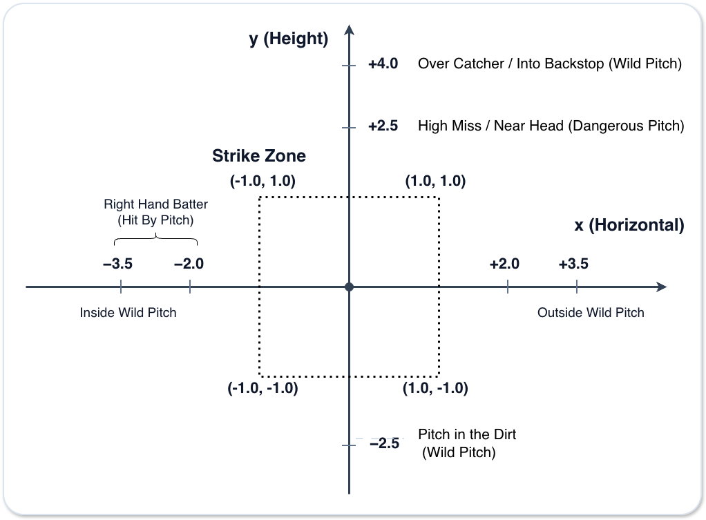
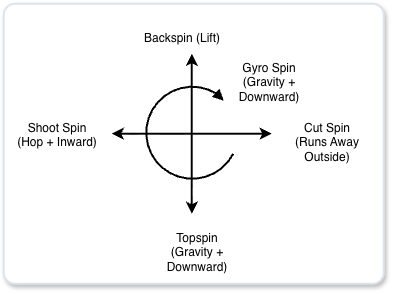

# Spatial Coordinates of Pitching

#### Hit-by-Pitch Conditions

- If the batter takes the pitch
  - If the batter successfully avoids the ball, it is called a ball.
  - If the batter fails to avoid the ball, it is a hit by pitch.
- If the batter swings
  - If the ball hits the bat, it becomes a foul ball off the handle or a pitcher grounder.
  - If the batter swings and misses, it is a strike.

#### Wild-Pitch Conditions

- If the batter takes the pitch
  - It is a ball. If runners are on base, evaluate advancement.
- If the batter swings
  - It is a strike and does not contact the bat.

# Pitching Physics

### Effects by Spin Axis

### Fastball Spin Direction by Arm Slot

| Pitching form | Right-handed pitcher (clock / angle) | Left-handed pitcher (clock / angle) |
| ---- | ---- | ---- |
| Overhand | Around 1:00 (about 30°) | Around 11:00 (about 330°) |
| Three-quarter | Around 2:00 (about 60°) | Around 10:00 (about 300°) |
| Sidearm | Around 3:00 (about 90°) | Around 9:00 (about 270°) |
| Submarine | Around 4:00 (about 120°) | Around 8:00 (about 240°) |

### Effect of Spin Direction

- Backspin
  - Produces a fastball that resists gravity and does not drop as much, creating carry.
- Topspin
  - Causes the ball to drop faster than gravity alone.
- Sidespin
  - Creates a trajectory that runs away to the outside corner against a right-handed batter (slider) or cuts inside (shuuto).
- Gyro spin
  - Minimizes air resistance and lets the ball drop according to gravity.

### Effect of Breaking Balls on the Spin Axis

- For right-handed pitchers:
  - Slider (counterclockwise): shifts in the negative direction from the base axis (leftward)
  - Shuuto/changeup (clockwise): shifts in the positive direction from the base axis (rightward)

- For left-handed pitchers:
  - Slider (clockwise): shifts in the positive direction from the base axis (rightward)
  - Shuuto/changeup (counterclockwise): shifts in the negative direction from the base axis (leftward)

### Effect of Spin Rate (rpm)

- High spin rate
  - Fastball: tends to pass under the bat, increasing whiffs and popup contact.
  - Curveball: vertical drop becomes sharper.
- Low spin rate
  - Fastball: because the Magnus effect is weak, the ball drops more easily due to gravity.
  - Dropping pitches such as forkballs and changeups: vertical drop becomes sharper.

### Movement of Breaking Balls Compared with a Fastball

**1. Calculating Movement Force (Movement Amount) from the Magnus Effect**

$$k = \text{effective\_spin} \cdot v \cdot C_{\text{magnus}} \quad (C_{\text{magnus}} \approx \text{constant})$$
$$\text{effective\_spin} = \text{spin\_rate} \cdot \text{spin\_efficiency}$$

- $\text{effective\_spin}$: the spin rate that actually contributes to movement, calculated by multiplying spin rate ($\text{spin\_rate}$) by spin efficiency ($\text{spin\_efficiency}$)
- $v$ (pitch velocity): the relative velocity at which air and the ball interact. The higher the pitch velocity, the greater the resulting air resistance and Magnus force.

$$\Delta X = k \cdot \sin(\text{spin\_dir}) \quad (\text{horizontal movement})$$
$$\Delta Y = k \cdot \cos(\text{spin\_dir}) - Y_{\text{fastball\_ref}} \quad (\text{vertical movement: difference from standard fastball})$$

- Vertical movement always includes gravitational acceleration ($\approx 9.81 \text{ m/s}^2$).
- The difference from a standard fastball represents deviation from the predicted drop caused by force.

**2. Movement Comparison**

| Pitch type | Velocity | rpm | Angle | Movement difference $D$ |
| ---- | ---- | ---- | ---- | ---- |
| Average fastball | 150 km/h | 2300 rpm | 0° | $D \approx 0.00$ |
| High-spin fastball | 155 km/h | 2700 rpm | 0° | $D \approx 0.17$ |
| Gyro cutter | 145 km/h | 1200 rpm | 270° | $D \approx 1.12$ |
| Drop curve | 125 km/h | 2500 rpm | 180° | $D \approx 2.08$ |

### Release Point

#### $Z$ Axis (Height): Body Height x Arm Slot

- Components: $\text{body height} \times \text{arm-slot angle} - \text{drop-in height (knees/mound)}$
- Height above the mound:
  - Overhand: 1.9 m to 2.1 m
  - Three-quarter: 1.6 m to 1.8 m
  - Sidearm: 1.2 m to 1.4 m
  - Submarine: 0.5 m to 0.9 m
- Effect: the higher $Z$ is, the steeper the approach angle and the faster the pitch feels. The lower $Z$ is, the more it creates the illusion that the ball is rising.

#### $X$ Axis (Left/Right): Throwing Arm x Arm Slot x Stride Position

- Components: $\text{throwing hand (+/-)} \times \text{arm-slot spread} + \text{standing position on the rubber}$
- X-axis direction and distance:
  - Right-handed pitcher ($+X$ direction): $+0.3\text{m}$ (overhand) to $+0.9\text{m}$ (sidearm)
  - Left-handed pitcher ($-X$ direction): $-0.3\text{m}$ (overhand) to $-0.9\text{m}$ (sidearm)
- Effect: the larger the absolute value of $X$, the steeper the crossfire angle becomes, making the ball harder to see in right-on-right and left-on-left matchups.

#### $Y$ Axis (Depth / Extension): Pitcher Traits (Release Timing Tendencies)

- Components: how many meters in front of the plate the pitcher releases the ball
- Stride distance from the plate:
  - Average pitcher: 1.8 m to 1.9 m ($Y \approx 16.55\text{m} \sim 16.64\text{m}$)
  - Early-release pitcher: 1.5 m to 1.7 m (the batter feels farther away)
  - Late-release pitcher: 2.0 m to 2.2 m (the batter feels closer, greatly increasing perceived velocity)
- Effect: the closer $Y$ is to the batter, the higher the batter's perceived pitch velocity becomes and the harder timing is.

### Time Until the Ball Arrives from the Release Point to the Batter's Contact Point

Effective distance to the contact point over home plate, $D_{\text{flight}}$:

$$D_{\text{flight}} = \text{release\_point.y} \quad (\text{example: } 18.44\text{m} - 1.9\text{m} = 16.54\text{m})$$

Average pitch velocity $v_{\text{avg}}$ ($\text{m/s}$), accounting for deceleration from air resistance:

$$v_{\text{avg}} = \left( \frac{\text{speed\_kmh}}{3.6} \right) \times \text{DRAG\_FACTOR} \quad (\text{DRAG\_FACTOR } \approx 0.95)$$

Time until the ball arrives (`flight_time`):

$$\text{flight\_time} = \frac{D_{\text{flight}}}{v_{\text{avg}}}$$

### How Pitchers Use Spin

By changing spin direction, the pitcher disrupts the batter's eye level; by changing spin rate, the pitcher creates more movement than expected and avoids the bat's sweet spot.

**Examples**

| Pitch type | Spin rate | Spin angle | Spin efficiency | X movement | Behavior near the batter's hands |
| ---- | ---- | ---- | ---- | ---- | ---- |
| Slider | 2600 rpm | 90° | 0.85 | +3.2 m/s² | Runs sharply away to the outside corner |
| Gyro cutter | 2400 rpm | 90° | 0.25 | +0.7 m/s² | Moves slightly and misses the sweet spot |
| Shuuto / sinker | 2200 rpm | 270° | 0.80 | -2.5 m/s² | Cuts sharply in toward the hands |
| Straight fastball with little run | 2400 rpm | 0° | 0.95 | 0.0 m/s² | Continues through the pitch tunnel |

### Landing-Point Prediction Gap

**Decision point ($t_d$)**
- Position $y(t_d) = \frac{1}{2} a t_d^2$
- Velocity $y'(t_d) = a t_d$

**Prediction at the batter's swing-decision point ($t_f$):**

$$y_{\text{predicted}} = \frac{1}{2} a t_d^2 + a t_d (t_f - t_d) = a t_d t_f - \frac{1}{2} a t_d^2$$

**Actual arrival point**

$$y_{\text{actual}} = \frac{1}{2} a t_f^2$$

**Difference from the prediction**

$$\text{spacial\_offset\_y} = y_{\text{actual}} - y_{\text{predicted}} = \frac{1}{2} a (t_f - t_d)^2$$

### Timing Gap

$$\Delta t = t_{\text{actual}} - t_{\text{expected}}$$

- $t_{\text{actual}}$: actual ball passing time
- $t_{\text{expected}}$: batter's predicted time
- $\Delta t > 0$: late swing
  - The ball arrived earlier than expected, or the batter started the swing late.
- $\Delta t < 0$: fooled out front
  - The ball arrived later than expected, or the batter started the swing early.

#### Cause of Gap 1: Stride Distance

$$\Delta t_{\text{extension}} = \frac{18.44 - \text{extension}}{v_{\text{avg}}} - \frac{18.44 - \text{std\_extension}}{v_{\text{avg}}}$$

- Example:
  - If the release point's Y extension is 2.1 m, the ball arrives about 6 ms earlier than it would from a pitcher with 1.85 m of extension.

#### Cause of Gap 2: Difference from the Batter's Predicted Pitch Velocity

- Perceived velocity of a fastball
  - When extension is long and spin rate is high, perceived velocity becomes faster than the batter's predicted velocity, causing $\Delta t > 0$ (late swing).

- Speed differential from a changeup or forkball
  - If a slower changeup or forkball comes from the same delivery as a fastball, it causes $\Delta t < 0$ (fooled out front).

#### Cause of Gap 3: Vertical Movement

- Dropping pitches (forkball/curveball)
  - Vertical movement shifts the timing at which the ball passes through the intersection between the bat path and ball path.

#### Cause of Gap 4: Pitch Location

| Location | Impact point | Effect | Mechanism |
| ---- | ---- | ---- | ---- |
| Inside | Out front | $+\Delta t$ (late swing) | The ball arrives before the bat head turns through, reducing reaction time. |
| Outside | Deep | $-\Delta t$ (fooled out front) | The batter lets the ball travel before hitting it, increasing reaction time. |
| High | Slightly out front | $+\Delta t$ (late swing) | The pitch is off the shortest route of the swing path, delaying swing initiation. |
| Low | Slightly deep | $-\Delta t$ (fooled out front) | The swing path follows gravity more naturally, making it easier to let the ball travel. |

**Effect of the Batter's Location Prediction**

$$\Delta \text{Loc} = \text{Loc}_{\text{actual}} - \text{Loc}_{\text{expected}}$$

- $\text{Loc}_{\text{actual}}$: actual location
- $\text{Loc}_{\text{expected}}$: batter's predicted location
- $\Delta \text{Loc}$: prediction error
  - If the actual location is close to the prediction, the location bias is reduced; if it is far from the prediction, the bias is amplified.

