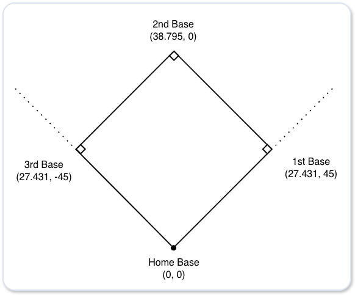

# Spatial coordinates of Stadium

ゲーム内では極座標を使用する。

**(飛距離$R$、水平角 $\theta$)**

# 打球の物理

### 速度の基本

$$V_{solid} \approx a \cdot V_{pitch} + b \cdot V_{swing}$$
- $V_{solid}$ ：打球速度
- $V_{pitch}$ ：球速
- $V_{swing}$ ：スイング速度
- $a, b$ ：反発係数などから決まる定数（一般に $b$ の方がかなり大きい）

### スピン方向の影響
- バックスピン（下から上への回転）
  - 失速せずに遠くへ伸びるフライになる。
- トップスピン（上から下への回転）
  - ドライブがかかって急速に失速し、地を這うゴロになる。
- サイドスピン（横回転）
  - ファールゾーンへ切れていくドライブになる。
- ジャイロ回転（ライフル弾のようなドリル回転）
  - 飛距離が出ず失速する。

### 回転数(rpm)の影響
- 回転数が高い場合
  - 滞空時間が長くなり、飛距離が大幅に伸びる。
- 回転数が低い場合
  - 空気抵抗で途中で不規則にブレて失速する。

### スピン方向と回転数の影響の例

| 回転の方向 | 回転数 | 挙動 | スピードと飛距離への影響 |
| ---- | ---- | ---- | ---- |
| バックスピン | 多い | 理想のホームラン弾道 | 初速が維持され、空中での滞空時間が最長になる。 |
| バックスピン | 低い | ライナー性／失速弾 | 伸びずに途中で失速して落ちる。 |
| トップスピン | 多い | 強烈なドライブゴロ | 打球速度自体は速くても、即座にグラウンドに突き刺さる。 |
| サイドスピン | 多い | 切れこむファール・ライナー | 横へ大きく曲がるため、フェアグラウンド内に留まりにくい。 |

### 打者視点でのスピンの活用方法

ボールの下側を捉えて「きれいなバックスピン（方向）」を「高回転（速さ）」でかけ直すことで、マグヌス効果を最大限に生かして飛距離を伸ばす。

### 打撃時のバットの芯からのズレ

2次元の極座標のベクトルで表現する。

- ズレの大きさ $d$（距離）： 0.0（芯ぴったり）〜 1.0（バットの端）
- ズレの方向 $\theta$（角度）： ボール中心から見て、バットが当たった位置の方向（0°〜360°）

### ズレの発生要因

打者は投手のリリース、球速、過去の球筋の記憶から、ボールがキャッチャーミットに届くまでの軌道を予測している。
軌道が予測通りであれば、打者はスイング軌道をボールの変化に合わせてバットを芯で捉えることができると仮定する。
（※打ち損じは別途考慮する）

### 予測誤差

$$\text{Difficulty} = \Vert{}\vec{M}_{\text{actual}} - \vec{M}_{\text{expected}}\Vert{}$$

- 基準予測点（デフォルトの直球イメージ）：$\vec{M}_{\text{expected}}$ 
- 実際の球の物理変化量：$\vec{M}_{\text{actual}}$

### 誤差の発生原因

**打者の錯覚**

- ピッチトンネル（例：フォークボール）
  - 投球の途中まで直球と同じ軌道を通り、そこから急激に変化量が発生するため、バッターがスイングを開始した後に予測とのズレが生じる。
- ホップするボール（例：高回転ストレート）
  - 重力で30cm落ちるはずの直球が、強い揚力で15cmしか落ちなかった場合、打者は15cm浮き上がったと錯覚する。
- 沈むボール（例：低回転ストレート）
  - 重力で30cm落ちるはずの直球が、揚力ゼロで45cm落ちた場合、打者は15cm沈んだと錯覚する。

**ボールの特性**

- ボールの変化量（例：大きく曲がるスライダー）
  - 変化量が大きすぎると、スイング軌道とボール軌道の立体的な交点（インパクトゾーン）が狭まる。

**投手のリリースポイント**

- プレートからの踏み出し距離による打者の反応時間の減少
  - 体感球速の計算（プレートの2.1m先からリリースする投手の場合、実際の球速が150km/hでも体感球速は154km/hになる）
$$\text{perceived\_speed} = \text{speed} \times \left( \frac{\text{標準投手-打者間距離}}{\text{実際のリリース-打者間距離}} \right)$$

- 低いリリースポイント
  - サイドスローやアンダースローの場合、入射角が平坦になり、同じボールでも打者の視線より浮き上がって見える。
- クロスファイヤー
  - 左投手がプレートの極端な三塁側から右打者の内角へ投げ込むと、水平入射角が急になり、打者から見ると背中からボールが飛んでくるような錯覚が生まれる。

### 投球スピンと打撃（衝突）スピンの合成

スピンの角度を$X$ 成分（サイドスピン）と $Y$ 成分（縦スピン）に分解して、それぞれ足し合わせる。

**$Y$ 成分（縦スピン）：**
$$\text{spin\_y} = \text{spin\_rate} \cdot \cos(\text{spin\_dir})$$
  - $+Y$：バックスピン（揚力）
  - $-Y$：トップスピン（ドロップ）

**$X$ 成分（サイドスピン）：**
$$\text{spin\_x} = \text{spin\_rate} \cdot \sin(\text{spin\_dir})$$
  - $+X$：スライダー回転（右へ曲がる）
  - $-X$：シュート回転（左へ曲がる）

**合成の例**

1. 直球のボールの下部を打ち返したケース
   - 衝突スピン：バックスピン成分（$+Y$）
   - 投球スピン：直球なのでバックスピン成分（$+Y$）
   - 結果：$+Y$ 同士が足し合わされ、打球のバックスピン量が増幅（飛距離アップ）。

2. カーブのボールの下部を打ち返したケース
   - 衝突スピン：フライにしようとしてバックスピン成分（$+Y$）をかける。
   - 投球スピン：カーブなのでトップスピン成分（$-Y$）が残っている。
   - 結果：$+Y$ と $-Y$ が相殺され、打ち上げたのにバックスピンがかからず、打球が伸びない。
  
3. カットボールを打ち返したケース
   - 衝突スピン：センター返ししようと縦スピン主体（$X=0$）で打つ。
   - 投球スピン： カットボールのサイドスピン成分（$+X$ または $-X$）
   - 結果： サイドスピン横成分が残り、芯で捉えたはずのライナーがファールゾーンへ切れていく。

### 打球の回転軸

衝突点 $\theta$ に対する打球のスピン方向は $\theta + 180^\circ$ （反対方向） となる。

| バットが当たった位置（$\theta$） | 打球の方向 | 打球スピン | 打球の挙動 |
| ---- | ---- | ---- | ---- |
| 下側（180° / 6時）  | 上 | バックスピン（0° / 12時） | 初揚力で伸びるフライ |
| 上側（0° / 12時）  | 下 | トップスピン（180° / 6時） | ドライブがかかるゴロ |
| 右側（90° / 3時）  | 左 | シュート回転（270° / 9時） | 左へ切れるライナー（右打者の引っ張り） |
| 左側（270° / 9時）  | 右 | スライダー回転（90° / 3時） | 右へ切れるライナー（右打者の流し） |

### 打球の回転数

$$\text{generated\_spin\_rate} = \text{MAX\_SPIN} \times d \times V_{\text{swing\_impact}}$$

1. ズレの大きさ $d$： 芯（$d=0$）なら回転は0に近く、$d$ が大きくなるほど高回転になる。
2. スイング速度（$\text{swing\_impact}$）： 速いスイングでボールを擦るほど、強烈なスピンがかかる。
3. 効率のトレードオフ： $d$ が大きくなると回転数は上がるが、打球速度は遅くなる。

### 打球種類別の打ち出し角度とスピン角度

| 打球種別 | 打出し角度 | スピン角度 | 回転数 | スピンによる弾道特性 |
| ---- | ---- | ---- | ---- | ---- |
| ゴロ | 10° 未満 | 120° 〜 180° | 1,000 〜 2,500 rpm | 地面に叩きつけられてバウンドする。 |
| ライナー1 | 10° 〜 25° | 0° 〜 15° | 2,000 〜 2,800 rpm | 伸びて外野の頭を越えやすい。 |
| ライナー2 | 10° 〜 25° | 15° 〜 45° | 1,500 〜 2,000 rpm | 失速して沈みやすい。 |
| フライ | 25° 〜 50° | 0° 〜 30° | 2,000 〜 3,200 rpm | マグヌス効果で滞空時間が伸び、ホームランになりやすい。 |
| ポップアップ | 50° 以上 | 0° 付近 | 3,500 〜 5,000+ rpm | 真上に上がって落ちてくる。 |

### マグヌス効果を加味した実効加速度

斜方投射の公式における $g$（重力 9.81）を、スピンによる揚力・重力補正を加味した $g_{eff}$（実効重力加速度） に置き換える。

$$g_{eff} = g - a_{magnus} \cdot \cos(\text{spin\_dir})$$
$$a_{magnus} \approx C \cdot \text{spin\_rate} \cdot v$$

- バックスピン： 上向きの力が発生するため、ボールが感じる重力が軽くなる（$g_{eff} < g$）。
- トップスピン： 下向きの力が発生するため、ボールが感じる重力が重くなる（$g_{eff} > g$）。

### 水平打出し角（初速ベクトル）の初期値

バットとボールの衝突の瞬間（タイミグのズレ）によって決定。

- 右打者の引っ張り（早いタイミング）：$-X$（レフト方向）
- 右打者の流し打ち（遅いタイミング）：$+X$（ライト方向）
- 左打者の引っ張り（早いタイミング）：$+X$（ライト方向）
- 左打者の流し打ち（遅いタイミング）：$-X$（レフト方向）

### サイドスピン成分（回転によるX加速度）の影響

打球のスピン角度から、サイドスピン成分（左右に曲げる力）を抽出する。

**例**
- スピン角度 = 90°（3:00 / スライダー回転）：右方向（$+X$）へ曲がる。
- スピン角度 = 270°（9:00 / シュート・スライス回転）：左方向（$-X$）へ曲がる。

### 最終的な水平打ち出し角

$$\text{spray\_angle} = \underbrace{\text{HLA}_{\text{initial}}}_{\text{① 初期の打出し角度}} + \underbrace{\Delta \theta_{\text{side\_spin}}}_{\text{② サイドスピンによる滞空中曲がり角度}}$$

1. 初期の打出し角度 ($\text{HLA}_{\text{initial}}$)： 打撃（衝突）時のタイミングのズレで決まる水平打ち出し角。
2. サイドスピンによる曲がり ($\Delta \theta_{\text{side\_spin}}$)： スライダーやシュート回転のX方向の加速度によって旋回した角度。

$$x_{\text{side}} = \frac{1}{2} \cdot a_{\text{side}} \cdot t^2$$
$$\Delta \theta_{\text{side\_spin}} = \text{atan2}(x_{\text{side}}, \text{distance\_y})$$

### 打球の最終的なX座標の計算

打球の最終的なX座標は、「初速による直線運動」＋「サイドスピンによる二次曲線的な曲がり」 の足し算で求める。

$$X_{\text{final}} = \underbrace{V_{\text{horizontal}} \cdot \sin(\text{HLA}) \cdot \text{time}}_{\text{① 直線移動}} \;+\; \underbrace{\frac{1}{2} \cdot a_{\text{side}} \cdot \text{time}^2}_{\text{② サイドスピンによる曲がり}}$$

サイドスピンによるX加速度 $a_{\text{side}}$ は、スピン方向の $\sin$ 成分で求める。

$$a_{\text{side}} = a_{\text{magnus}} \cdot \sin(\text{spin\_dir})$$

サイドスピンによる曲がりは等加速度運動のため、滞空時間が長い高めのフライのようなケースでは影響が大きくなる。

### 打球の挙動の例

1. ファールゾーンへ切れていくファールフライ（スライス）
- 右打者の流し打ち：水平打出し角＝+20°、スピン角度 = 90°
- 挙動：打ち上がった直後はファールグラウンド方向（右）へ飛び出し、さらに滞空中に右へ大きく曲がりこんでファールグラウンドの客席へ落ちる。

2. ドライブしてファールグラウンドへ切れるライナー
- 右打者の引っ張り：水平打出し角＝-30°
- 挙動：時間の経過とともにファールグラウンド方向（左）への曲がりが増幅し、サード・レフト線を越えてファールになる。

3. 右中間・左中間を抜ける伸びるライナー
- 綺麗なバックスピンがかかっている場合、サイドスピンによるX加速度は $0$ に近くなり、水平打出し角の角度のまま直線的に打球が飛び、打球速度が殺されずに長打になる。

### 垂直打ち出し角の計算

- 打者ごとにベース打角を持つ。
- 打撃時のボールとのコンタクト状態で角度を修正する。

**例**

| コンタクト状態 | 修正角度 | ベース打角 | 打ち出し角 | 打球種別 |
| ---- | ----: | ----: | ----: | ---- |
| ボールの上を叩いた | -30° | 28° | 2° | ゴロ |
| ボールの少し上を叩いた | -15° | 28° | 13° | 低いライナー |
| 芯で捉えた | 0° | 28° | 28° | 長打コース（フライ／ライナー） |
| ボールの少し下を叩いた | +15° | 28° | 43° | フライ |
| ボールの下を叩いた | +30° | 28° | 58° | ポップアップ |

# Batting Process Flow
