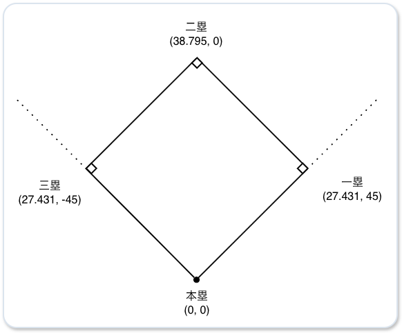
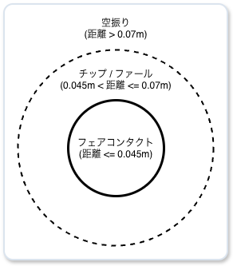
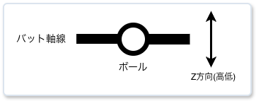
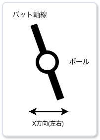
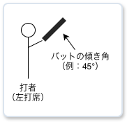
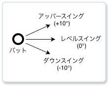
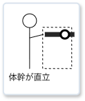
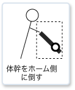

# Spatial coordinates of Stadium

ゲーム内では極座標を使用する。

**(飛距離$R$、水平角 $\theta$)**

# 打球の物理

### 速度の基本

$$V_{solid} \approx a \cdot V_{pitch} + b \cdot V_{swing}$$
- $V_{solid}$ ：打球速度
- $V_{pitch}$ ：球速
- $V_{swing}$ ：スイング速度
- $a, b$ ：反発係数などから決まる定数（一般に $b$ の方がかなり大きい）

### スピン方向の影響
- バックスピン（下から上への回転）
  - 失速せずに遠くへ伸びるフライになる。
- トップスピン（上から下への回転）
  - ドライブがかかって急速に失速し、地を這うゴロになる。
- サイドスピン（横回転）
  - ファールゾーンへ切れていくドライブになる。
- ジャイロ回転（ライフル弾のようなドリル回転）
  - 飛距離が出ず失速する。

### 回転数(rpm)の影響
- 回転数が高い場合
  - 滞空時間が長くなり、飛距離が大幅に伸びる。
- 回転数が低い場合
  - 空気抵抗で途中で不規則にブレて失速する。

### スピン方向と回転数の影響の例

| 回転の方向 | 回転数 | 挙動 | スピードと飛距離への影響 |
| ---- | ---- | ---- | ---- |
| バックスピン | 多い | 理想のホームラン弾道 | 初速が維持され、空中での滞空時間が最長になる。 |
| バックスピン | 低い | ライナー性／失速弾 | 伸びずに途中で失速して落ちる。 |
| トップスピン | 多い | 強烈なドライブゴロ | 打球速度自体は速くても、即座にグラウンドに突き刺さる。 |
| サイドスピン | 多い | 切れこむファール・ライナー | 横へ大きく曲がるため、フェアグラウンド内に留まりにくい。 |

### 打者視点でのスピンの活用方法

ボールの下側を捉えて「きれいなバックスピン（方向）」を「高回転（速さ）」でかけ直すことで、マグヌス効果を最大限に生かして飛距離を伸ばす。

### 打撃時のバットの芯からのズレ

2次元の極座標のベクトルで表現する。

- ズレの大きさ $d$（距離）： 0.0（芯ぴったり）〜 1.0（バットの端）
- ズレの方向 $\theta$（角度）： ボール中心から見て、バットが当たった位置の方向（0°〜360°）

### ズレの発生要因

打者は投手のリリース、球速、過去の球筋の記憶から、ボールがキャッチャーミットに届くまでの軌道を予測している。
軌道が予測通りであれば、打者はスイング軌道をボールの変化に合わせてバットを芯で捉えることができると仮定する。
（※打ち損じは別途考慮する）

### 予測誤差

$$\text{Difficulty} = \Vert{}\vec{M}_{\text{actual}} - \vec{M}_{\text{expected}}\Vert{}$$

- 基準予測点（デフォルトの直球イメージ）：$\vec{M}_{\text{expected}}$ 
- 実際の球の物理変化量：$\vec{M}_{\text{actual}}$

### 誤差の発生原因

**打者の錯覚**

- ピッチトンネル（例：フォークボール）
  - 投球の途中まで直球と同じ軌道を通り、そこから急激に変化量が発生するため、バッターがスイングを開始した後に予測とのズレが生じる。
- ホップするボール（例：高回転ストレート）
  - 重力で30cm落ちるはずの直球が、強い揚力で15cmしか落ちなかった場合、打者は15cm浮き上がったと錯覚する。
- 沈むボール（例：低回転ストレート）
  - 重力で30cm落ちるはずの直球が、揚力ゼロで45cm落ちた場合、打者は15cm沈んだと錯覚する。

**ボールの特性**

- ボールの変化量（例：大きく曲がるスライダー）
  - 変化量が大きすぎると、スイング軌道とボール軌道の立体的な交点（インパクトゾーン）が狭まる。

**投手のリリースポイント**

- プレートからの踏み出し距離による打者の反応時間の減少
  - 体感球速の計算（プレートの2.1m先からリリースする投手の場合、実際の球速が150km/hでも体感球速は154km/hになる）
$$\text{perceived\_speed} = \text{speed} \times \left( \frac{\text{標準投手-打者間距離}}{\text{実際のリリース-打者間距離}} \right)$$

- 低いリリースポイント
  - サイドスローやアンダースローの場合、入射角が平坦になり、同じボールでも打者の視線より浮き上がって見える。
- クロスファイヤー
  - 左投手がプレートの極端な三塁側から右打者の内角へ投げ込むと、水平入射角が急になり、打者から見ると背中からボールが飛んでくるような錯覚が生まれる。

### 投球スピンと打撃（衝突）スピンの合成

スピンの角度を$X$ 成分（サイドスピン）と $Y$ 成分（縦スピン）に分解して、それぞれ足し合わせる。

**$Y$ 成分（縦スピン）：**
$$\text{spin\_y} = \text{spin\_rate} \cdot \cos(\text{spin\_dir})$$
  - $+Y$：バックスピン（揚力）
  - $-Y$：トップスピン（ドロップ）

**$X$ 成分（サイドスピン）：**
$$\text{spin\_x} = \text{spin\_rate} \cdot \sin(\text{spin\_dir})$$
  - $+X$：スライダー回転（右へ曲がる）
  - $-X$：シュート回転（左へ曲がる）

**合成の例**

1. 直球のボールの下部を打ち返したケース
   - 衝突スピン：バックスピン成分（$+Y$）
   - 投球スピン：直球なのでバックスピン成分（$+Y$）
   - 結果：$+Y$ 同士が足し合わされ、打球のバックスピン量が増幅（飛距離アップ）。

2. カーブのボールの下部を打ち返したケース
   - 衝突スピン：フライにしようとしてバックスピン成分（$+Y$）をかける。
   - 投球スピン：カーブなのでトップスピン成分（$-Y$）が残っている。
   - 結果：$+Y$ と $-Y$ が相殺され、打ち上げたのにバックスピンがかからず、打球が伸びない。
  
3. カットボールを打ち返したケース
   - 衝突スピン：センター返ししようと縦スピン主体（$X=0$）で打つ。
   - 投球スピン： カットボールのサイドスピン成分（$+X$ または $-X$）
   - 結果： サイドスピン横成分が残り、芯で捉えたはずのライナーがファールゾーンへ切れていく。

### 打球の回転軸

衝突点 $\theta$ に対する打球のスピン方向は $\theta + 180^\circ$ （反対方向） となる。

| バットが当たった位置（$\theta$） | 打球の方向 | 打球スピン | 打球の挙動 |
| ---- | ---- | ---- | ---- |
| 下側（180° / 6時）  | 上 | バックスピン（0° / 12時） | 初揚力で伸びるフライ |
| 上側（0° / 12時）  | 下 | トップスピン（180° / 6時） | ドライブがかかるゴロ |
| 右側（90° / 3時）  | 左 | シュート回転（270° / 9時） | 左へ切れるライナー（右打者の引っ張り） |
| 左側（270° / 9時）  | 右 | スライダー回転（90° / 3時） | 右へ切れるライナー（右打者の流し） |

### 打球の回転数

$$\text{generated\_spin\_rate} = \text{MAX\_SPIN} \times d \times V_{\text{swing\_impact}}$$

1. ズレの大きさ $d$： 芯（$d=0$）なら回転は0に近く、$d$ が大きくなるほど高回転になる。
2. スイング速度（$\text{swing\_impact}$）： 速いスイングでボールを擦るほど、強烈なスピンがかかる。
3. 効率のトレードオフ： $d$ が大きくなると回転数は上がるが、打球速度は遅くなる。

### 打球種類別の打ち出し角度とスピン角度

| 打球種別 | 打出し角度 | スピン角度 | 回転数 | スピンによる弾道特性 |
| ---- | ---- | ---- | ---- | ---- |
| ゴロ | 10° 未満 | 120° 〜 180° | 1,000 〜 2,500 rpm | 地面に叩きつけられてバウンドする。 |
| ライナー1 | 10° 〜 25° | 0° 〜 15° | 2,000 〜 2,800 rpm | 伸びて外野の頭を越えやすい。 |
| ライナー2 | 10° 〜 25° | 15° 〜 45° | 1,500 〜 2,000 rpm | 失速して沈みやすい。 |
| フライ | 25° 〜 50° | 0° 〜 30° | 2,000 〜 3,200 rpm | マグヌス効果で滞空時間が伸び、ホームランになりやすい。 |
| ポップアップ | 50° 以上 | 0° 付近 | 3,500 〜 5,000+ rpm | 真上に上がって落ちてくる。 |

### マグヌス効果を加味した実効加速度

斜方投射の公式における $g$（重力 9.81）を、スピンによる揚力・重力補正を加味した $g_{eff}$（実効重力加速度） に置き換える。

$$g_{eff} = g - a_{magnus} \cdot \cos(\text{spin\_dir})$$
$$a_{magnus} \approx C \cdot \text{spin\_rate} \cdot v$$

- バックスピン： 上向きの力が発生するため、ボールが感じる重力が軽くなる（$g_{eff} < g$）。
- トップスピン： 下向きの力が発生するため、ボールが感じる重力が重くなる（$g_{eff} > g$）。

### 水平打出し角（初速ベクトル）の初期値

バットとボールの衝突の瞬間（タイミグのズレ）によって決定。

- 右打者の引っ張り（早いタイミング）：$-X$（レフト方向）
- 右打者の流し打ち（遅いタイミング）：$+X$（ライト方向）
- 左打者の引っ張り（早いタイミング）：$+X$（ライト方向）
- 左打者の流し打ち（遅いタイミング）：$-X$（レフト方向）

### サイドスピン成分（回転によるX加速度）の影響

打球のスピン角度から、サイドスピン成分（左右に曲げる力）を抽出する。

**例**
- スピン角度 = 90°（3:00 / スライダー回転）：右方向（$+X$）へ曲がる。
- スピン角度 = 270°（9:00 / シュート・スライス回転）：左方向（$-X$）へ曲がる。

### 最終的な水平打ち出し角

$$\text{spray\_angle} = \underbrace{\text{HLA}_{\text{initial}}}_{\text{① 初期の打出し角度}} + \underbrace{\Delta \theta_{\text{side\_spin}}}_{\text{② サイドスピンによる滞空中曲がり角度}}$$

1. 初期の打出し角度 ($\text{HLA}_{\text{initial}}$)： 打撃（衝突）時のタイミングのズレで決まる水平打ち出し角。
2. サイドスピンによる曲がり ($\Delta \theta_{\text{side\_spin}}$)： スライダーやシュート回転のX方向の加速度によって旋回した角度。

$$x_{\text{side}} = \frac{1}{2} \cdot a_{\text{side}} \cdot t^2$$
$$\Delta \theta_{\text{side\_spin}} = \text{atan2}(x_{\text{side}}, \text{distance\_y})$$

### 打球の最終的なX座標の計算

打球の最終的なX座標は、「初速による直線運動」＋「サイドスピンによる二次曲線的な曲がり」 の足し算で求める。

$$X_{\text{final}} = \underbrace{V_{\text{horizontal}} \cdot \sin(\text{HLA}) \cdot \text{time}}_{\text{① 直線移動}} \;+\; \underbrace{\frac{1}{2} \cdot a_{\text{side}} \cdot \text{time}^2}_{\text{② サイドスピンによる曲がり}}$$

サイドスピンによるX加速度 $a_{\text{side}}$ は、スピン方向の $\sin$ 成分で求める。

$$a_{\text{side}} = a_{\text{magnus}} \cdot \sin(\text{spin\_dir})$$

サイドスピンによる曲がりは等加速度運動のため、滞空時間が長い高めのフライのようなケースでは影響が大きくなる。

### 打球の挙動の例

1. ファールゾーンへ切れていくファールフライ（スライス）
- 右打者の流し打ち：水平打出し角＝+20°、スピン角度 = 90°
- 挙動：打ち上がった直後はファールグラウンド方向（右）へ飛び出し、さらに滞空中に右へ大きく曲がりこんでファールグラウンドの客席へ落ちる。

2. ドライブしてファールグラウンドへ切れるライナー
- 右打者の引っ張り：水平打出し角＝-30°
- 挙動：時間の経過とともにファールグラウンド方向（左）への曲がりが増幅し、サード・レフト線を越えてファールになる。

3. 右中間・左中間を抜ける伸びるライナー
- 綺麗なバックスピンがかかっている場合、サイドスピンによるX加速度は $0$ に近くなり、水平打出し角の角度のまま直線的に打球が飛び、打球速度が殺されずに長打になる。

### 垂直打ち出し角の計算

- 打者ごとにベース打角を持つ。
- 打撃時のボールとのコンタクト状態で角度を修正する。

**例**

| コンタクト状態 | 修正角度 | ベース打角 | 打ち出し角 | 打球種別 |
| ---- | ----: | ----: | ----: | ---- |
| ボールの上を叩いた | -30° | 28° | 2° | ゴロ |
| ボールの少し上を叩いた | -15° | 28° | 13° | 低いライナー |
| 芯で捉えた | 0° | 28° | 28° | 長打コース（フライ／ライナー） |
| ボールの少し下を叩いた | +15° | 28° | 43° | フライ |
| ボールの下を叩いた | +30° | 28° | 58° | ポップアップ |

### バットの有効接触半径

### バットの角度による物理的挙動の違い

- バットの角度を$\theta_{\text{bat}}$と定義する。
  - 水平： $0^\circ$
  - グリップを下・ヘッドを上にした垂直方向： $90^\circ$

#### 1. 水平に近いスイング ($\theta_{\text{bat}} ≈ 0^\circ$)

- 特徴：バットは $X$ 方向に伸び、バットの直径は $Z$ 方向に向く。
- 物理的挙動： $X$ 方向にはバットの長さで広くカバーできるが、$Z$ 方向はバットの直径（約6.6cm）を外れると空振りになる。

#### 2. 垂直に近いスイング ($\theta_{\text{bat}} ≈ 60^\circ 〜 80^\circ$)

- 特徴： バットは $Z$ 方向に伸び、バットの直径は $X$ 方向に向く。
- 物理的挙動： バットの長さの一部が $Z$ 方向をカバーするように投影される。 逆に、$X$ 方向に対するカバーが短くなる。

### バットの芯からの距離の算出

空間のズレ $(X, Z)$ を、距離 $N$（$\text{m}$）に変換する。

$$N = -X \cdot \sin(\theta_{\text{bat}}) + Z \cdot \cos(\theta_{\text{bat}})$$

- $\theta_{\text{bat}} = 0^\circ$の場合：
  - $N = Z$ 高低のズレ$Z$がそのままバットの太さ方向のズレになる
- $\theta_{\text{bat}} = 90^\circ$の場合：
  - $N = -X$ 内角/外角のズレ$X$がそのままバットの太さ方向のズレになる

### コース別のバットの角度の違い

- 内角：$\theta_{\text{bat}}$ が大きくなる
- 内角：$\theta_{\text{bat}}$ が小さくなる
- 高め：$\theta_{\text{bat}}$ が小さくなる
- 低め：$\theta_{\text{bat}}$ が大きくなる

### 垂直打ち出し角の物理計算モデル

ベースとなるスイング進入角に、バットの円筒曲面に対する縦ズレ$z_m$による跳ね返り角度の偏向を加えて求める。

- 有効衝突半径（$R_{\text{eff}}$）：
  - バットの半径 $R_{\text{bat}} \approx 0.033\text{m}$（$3.3\text{cm}$）＋ ボールの半径 $R_{\text{ball}} \approx 0.037\text{m}$（$3.7\text{cm}$）$= \mathbf{0.070\text{m}}$（$7.0\text{cm}$）。
- 法線衝突角（$\phi_z$）：
$$\phi_z = \arcsin\left( \frac{z_m}{R_{\text{eff}}} \right) \quad (\text{ただし } \vert{}z_m\vert{} \le R_{\text{eff}})$$
  - $z_m$：バット中心とボール中心の縦方向のズレ

- 垂直打ち出し角（VLA）の算出式：
$$\text{VLA} = \theta_{\text{attack}} + \text{degrees}(\phi_z) \cdot k_{\text{vla\_rebound}}$$
  - $\theta_{\text{attack}}$：打者のスイング進入角
    - アッパースイングの場合、$+10^\circ \sim +15^\circ$
    - レベルスイングの場合、$0^\circ \sim +5^\circ$
  - $k_{\text{vla\_rebound}}$：バットの弾性・摩擦による反発偏向係数（$0.5 \sim 0.7$ 程度）
    - 剛体衝突ではなくボールが潰れるため、完全な法線方向よりスイング軌道側に引っ張られる

### 水平打ち出し角の物理計算モデル

スイング回転運動におけるバットの面角度と バット横断面の曲面による反発を加えて求める。

#### バットの面角度の傾き（$\phi_{\text{face}}$）：
$$\phi_{\text{face}} = \arcsin\left( \frac{x_m}{L_{\text{arm}}} \right)$$
- $x_m$：タイミング遅れ/早振りと内角/外角の空間ズレを統合したバットのインパクト位置
  - $x_m < 0$（インパクトのポイントが前）
    - バットの面が左（右打者の引っ張り方向）を向く
  - $x_m > 0$（インパクトのポイントが後）
    - バットの面が右（右打者の流し方向）を向く
- $\phi_{\text{face}}$：ミート位置が前後に$x_m$ズレた際のバットの向き
- 打者の体幹/肩を中心としたスイング回転半径：$L_{\text{arm}} \approx 1.1\text{m}$

#### 横方向の曲面反発（$\phi_{\text{rebound}}$）：

縦方向と同様に、バットの横方向の円筒曲面に対する横ズレ$x_m$による跳ね返り角度の偏向も加わる。

$$\phi_{\text{rebound}} = \arcsin\left( \frac{x_m}{R_{\text{eff}}} \right)$$

- 水平打ち出し角（HLA）の算出式：
$$\text{HLA} = \text{BaseSprayAngle} + \text{degrees}(\phi_{\text{face}}) \cdot k_{\text{face}} + \text{degrees}(\phi_{\text{rebound}}) \cdot k_{\text{rebound}}$$

- $k_{\text{face}}$：面角度の寄与度（$0.8 \sim 1.0$。タイミングのズレが打出角に与える主要因）
- $k_{\text{rebound}}$：横曲面反発の寄与度（$0.2 \sim 0.3$。バット先や根元に当たった場合の外側への反発）

### 物理計算モデルによる挙動

- バットの真芯で捕らえた場合（$x_m=0.0$, $z_m=0.0$）：
  - $\text{VLA} = \theta_{\text{attack}}$：スイング進入角そのままの理想的なライナー
  - $\text{HLA} = 0^\circ$：センター返し
- ボールの下側を叩いた場合（$z_m+0.035m$）：
  - $\arcsin(0.035 / 0.070) = 30^\circ \times 0.6 = +18^\circ$ 加算され、打球は垂直打ち出し角は約$+28^\circ$のフライとなる
- 振り遅れた場合（$x_m+0.05m$）：
  - バットの面が約$2.6^\circ$開く（$\times 0.85$） ＋ 曲面反発約 $45.5^\circ$（$\times 0.25$） $\approx +13.8^\circ$ により、打球は右方向へ流される

### 打球初速の基本運動方程式

$$V_{\text{max}} = c_{\text{pitch}} \cdot V_{\text{pitch}} + c_{\text{swing}} \cdot V_{\text{swing}}$$

- $V_{\text{max}}$： 真芯で捉えた場合の最大打球初速（$\text{m/s}$）
- $V_{\text{pitch}}$： 投球速度（$\text{m/s}$）
- $V_{\text{swing}}$： バットスイング速度（$\text{m/s}$）
- $c_{\text{pitch}}$（投球速度の反発寄与度）： 約 $0.15 \sim 0.20$ （球速の影響は $15\sim 20\%$ 程度）
- $c_{\text{swing}}$（スイング速度の寄与度）： 約 $1.15 \sim 1.25$ （打球初速の大部分はスイング速度で決まる）

### バットの芯からのオフセット距離による反発効率の減衰

インパクト地点がバットの芯からズレた場合、ボールが斜めに接触して滑るだけでなく、バットのしなりと振動によってエネルギーが逃げるため、初速が急速に減衰する。

減衰係数 $E_{\text{contact}}$（$0.0 \sim 1.0$）は、バット太さ方向のズレ（$d_{\text{thick}}$）と 長さ方向のズレ（$d_{\text{len}}$） の2つから求める。

#### 1.太さ方向の減衰（$E_{\text{thick}}$）

有効接触半径 $R_{\text{eff}} = 0.070\text{m}$（バット半径 $3.3\text{cm}$ ＋ ボール半径 $3.7\text{cm}$）に対し、芯から $2\text{cm}$（$0.020\text{m}$）までは最大反発を維持し、それ以降急激に落ちる平坦部付きのコサイン二乗カーブを適用する。

$$E_{\text{thick}} = \begin{cases} 1.0 & (d_{\text{thick}} \le 0.020) \\ \cos^2\left( \frac{\pi}{2} \cdot \frac{d_{\text{thick}} - 0.020}{0.070 - 0.020} \right) & (0.020 < d_{\text{thick}} < 0.070) \\ 0.0 & (d_{\text{thick}} \ge 0.070) \end{cases}$$

#### 2.長さ方向の減衰（$E_{\text{len}}$）

バットの芯からバットの先端や手元側へ外れた場合の損失。

- 先端側（$d_{\text{len\_tip}}$）： 先端に行くほどバットの周速は上がるが、質量が軽いため反発率は下がる
- 手元側（$d_{\text{len\_root}}$）： バットのしなりでエネルギーが大きく逃げるため、反発率の減衰が激しい

#### 実際の計算例（150km/h ストレート vs 125km/h スイング）

- 理論最大初速 $V_{\text{max}}$：
$$150 \times 0.18 + 125 \times 1.20 = 27 + 150 = 177.0 \text{ km/h}$$
- 真芯ヒット（$d_{\text{thick}} \le 2.0\text{cm}$）：
  - 反発効率 $100\%$ $\rightarrow$ $177.0 \text{ km/h}$ （クリーンヒット / ホームラン性の当たり）
- やや芯外し（$d_{\text{thick}} = 3.5\text{cm}$）：
  - 反発効率 $\approx 80\%$ $\rightarrow$ $141.6 \text{ km/h}$ （野手正面へのライナー / 外野フライ）
- 強烈な詰まり / 先端擦り（$d_{\text{thick}} = 5.5\text{cm}$）：
  - 反発効率 $\approx 22\%$ $\rightarrow$ $38.9 \text{ km/h}$ （ボテボテのピッチャーゴロ / ポップアップフライ）

### バット傾斜角とスイング進入角の違い

| パラメータ | バット傾斜角 | スイング進入角 |
| ---- | ---- | ---- |
| 見ている視点 | 投手の正面から見た角度 | ダグアウトから見た角度 |
| 角度の定義 | バットが地面に対してどれくらい傾いているか | バットの軌道が上下にどれくらい傾いているか |
| 数値の基準 | 0° = 完全水平 / 90° = 垂直 | 0° = レベル / +10° = アッパー / -5° = ダウン |
| 使われる目的 | バットの芯から何cm離れているか | ボールをどの角度で打ち返すか |

#### バット傾斜角：投手正面から見た視点

- インパクトした瞬間のバットの立体的な構え。
- $X$（左右）と $Z$（上下）の空間誤差をバットの円筒の太さ方向と長さ方向に分解して変換するために利用する

#### スイング進入角：ダグアウトから見た視点

- バットが後ろから前に向かって通過するスイング軌道の物理ベクトル。
- バットの真芯で捕らえた時に、ボールの飛び出す角度がそのまま垂直打ち出し角になる。

### バット傾斜角とスイング進入角の相関

#### 高めのスイング (バット傾斜角: 小)

- 高めの球（バット傾斜角が小さい / 20°前後）：
  - 体幹が直立に近いため、バットの回転面が地面と平行に近くなる。
  - スイング進入角は小さく（$+3^\circ \sim +8^\circ$ 程度） なる。

#### 低めのスイング (バット傾斜角: 大)

- 低めの球（バット傾斜角が大きい / 40°〜50°）：
  - ベース側へ大きく体幹を倒し込んで回転するため、バットの軌道は、地面に対して大きく上向きになる
  - スイング進入角は大きく（$+15^\circ \sim +22^\circ$ 程度） なる

### バッティングにおけるトルクの効果

- バットとボールが接触している時間はわずか約0.7〜1.0ms程度。
- バッターの筋力によるインパルス（力×時間）は物理的にはほぼゼロであり、ボールの反発には直接作用しない

#### パワーヒッターの物理的な表現

- バットの慣性モーメントの大きさ：
  - より重く、先端に重心があるバットを、速いスイングスピードで振り切ることができる

- 衝突時の実効質量の高さ：
  - ボールの衝撃に対してバットが手元でブレたり回転することなく、バット＋腕＋体幹を一体の実効質量にできる

#### $C_{\text{SWING}}$（最大伝達率）の物理的表現

$$C_{\text{swing}} = \frac{M}{M + m} (1 + e)$$

- $C_{\text{swing}}$：バットからボールへの運動量伝達係数
- $M$：バットの質量
- $m$：ボールの質量
- $e$：反発係数

#### $C_{\text{SWING}}$の例

- 普通の打者（軽量〜標準バット / 実効質量小）： $C_{\text{SWING}} \approx 1.12 \sim 1.18$
- パワーヒッター（重量バット / 実効質量大）： $C_{\text{SWING}} \approx 1.22 \sim 1.30$

#### 引っ張りの$C_{\text{SWING}}$への影響

引っ張りと逆方向では、同じスイング速度であっても打球初速に差が生じる。

**1.体幹の運動鎖の伝達**

- 身体の前（$x_m < 0$）
  - 体幹の回転が完了する最も身体の力がバットに乗る瞬間でボールを捉える。
    - 実効質量$M_{\text{eff}}$が最大化して、$C_{\text{SWING}}$が向上する。
- 捕手寄り（$x_m > 0$）
  - 体幹の回転をバットに伝え切る手前でコンタクトするため、バットが球の衝撃に押し負けやすい。
    - 実効質量$M_{\text{eff}}$が低下して、$C_{\text{SWING}}$が減少する。

**2.衝突の正面度（法線方向への力）**

- 引っ張り
  - スイング軌道に対してボールを正面から叩くため、スイングの運動エネルギーがほぼ100%初速に変換される。
- 逆方向
  - バット面が斜めに開いた状態でボールを叩くため、スイングの運動のエネルギーの一部がスピンに逃げ、初速が落ちる。

### 打者の予測によるズレ対応

#### 予測の種類

- コース予測：ストライクゾーンのどこに投げてくるか
- 球種と球速予測：150km/hのストレートか、130km/hのフォークか
- リリースポイント認知：投手のフォームから初期の軌道を即座に認識

#### 打者の対応メカニズム

**1.決断時間**

投手がボールをリリースしてから打者がスイングを途中で修正、または、止める判断ができる限界点が存在する。

- 球速150km/h（滞空時間 約0.40秒）の場合：
  - 打者が軌道を見極められる時間：約0.22秒〜0.24秒
  - スイング開始後の残り時間：約0.16秒

選球眼や反応速度が高い打者ほど、より遅いタイミングまでボールを見極めてからスイングを起動、修正できる。

**2.対応力**

ミート力の高い打者は、予測が外れた場合でも手元ズレのギャップを小さく抑えることができる。

$$\text{effective\_spatial\_gap} = \text{raw\_spatial\_gap} \times (1.0 - \text{batter\_adaptability})$$

タイミングが外された場合、スイング速度を犠牲にする代わりにタイミングの微調整が可能。

$$\text{effective\_timing\_gap} = \text{raw\_timing\_gap} \times (1.0 - \text{batter\_adaptability})$$
$$\text{effective\_swing\_speed} = \text{raw\_swing\_speed} \times (1.0 - \text{batter\_adaptability})$$