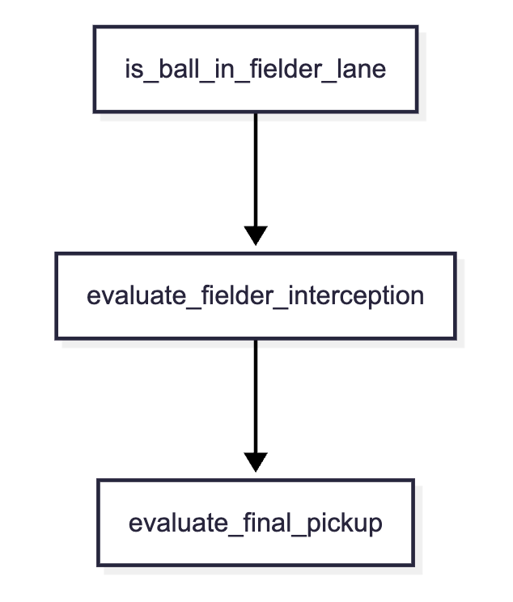

# 守備ロジック

# 守備処理の流れ

### 1. is_ball_in_fielder_lane

打球軌道上の捕球可能な野手を判定する

#### 野手別の捕球可能範囲

| 野手の種類 | 捕球可能な角度 |
| ---- | ---- |
| 投手 | 4.0° |
| 一塁手、三塁手 | 6.0° |
| 二塁手、遊撃手 | 8.0° |
| 外野手 | 12.0° |

$$\theta_{\text{coverage}} = \theta_{\text{coverage}} \cdot (1.0 + \text{FielderInfo.reach\_range} \cdot 0.05)$$

#### 補給可能かどうかの判定

$$\theta_{\text{fielder}} - \theta_{\text{ball}} \le \theta_{\text{coverage}}$$

### 2. evaluate_fielder_interception

飛翔中・ゴロでバウンド中のボールを途中で止める（フライ捕球、ゴロ捕球）。

#### 打球の現在位置の取得
#### 野手が捕球可能な高さの打球の将来位置に移動
1. 移動時間の判定
- 野手が初期位置からボールの水平位置 $(X(t), Y(t))$ に移動するのに必要な時間 $t_{\text{fielder}}$ を計算
$$t_{\text{fielder}} = t_{\text{reaction}} + \frac{\text{Distance}((X_{\text{f0}}, Y_{\text{f0}}), (X(t), Y(t)))}{v_{\text{fielder}}}$$

2. ボールの水平位置への到達時間に余裕がある場合は、先回りする
$$t_{\text{fielder}} \le t_{\text{ball}}$$
- 野手は先回りする時間の余裕があれば（$t_{\text{fielder}} < t$）、その地点でボールが落ちてくるのを待っている状態になり、確実にノーバウンドで捕球できる

3. 捕球可能な高さの判定
$$Z(t) \le Z_{\text{catch\_max}}$$

### 3. evaluate_final_pickup

ボールの軌道上で野手が止められず、ボールがフェンス際や外野の奥で停止、または減速した後に、最も近い野手がボールを捕球する

#### 捕球時間の判定

$$t_{\text{pickup}} = \max(t_{\text{ball\_stop}}, t_{\text{fielder\_travel}}) + t_{\text{pickup\_delay}}$$

- $t_{\text{ball\_stop}}$： ボールが停止した時間
- $t_{\text{fielder\_travel}}$： 野手が初期位置から最終位置 $(X_{\text{final}}, Y_{\text{final}})$ まで走るのに必要な時間
- $t_{\text{pickup\_delay}}$： クッションボールの処理や、停止したボールをピックアップする動作にかかる遅延時間（約 $0.3 \sim 0.5$ 秒）

#### 野手がボールの停止より先に到着した場合

$$t_{\text{pickup}} = t_{\text{fielder\_travel}} + t_{\text{ball\_stop}} + t_{\text{pickup\_delay}}$$
※野手はボールが止まるのを待ってから捕球する

#### 野手がボール停止後に到着した場合

$$t_{\text{pickup}} = t_{\text{fielder\_travel}} + t_{\text{pickup\_delay}}$$

### エラー判定

| エラー種別 | 発生条件 | 待ち時間 | ボール位置 | エラー対応 |
| ---- | ---- | ---- | ---- | ---- |
| ファンブル | ミット弾き   お手玉 | その場、または足元で停止 | 余裕あり | 処理時間にペナルティ加算 |
| 後逸 | 走り込みながらの捕球   逆シングル   無理なダイビング | ギリギリ | そのまま後方へ転がる | カバー処理に移行 |

#### エラー確率の算出

$$\text{ErrorRate} = (1.0 - \text{FielderInfo.catching}) \cdot \text{DifficultyFactor}$$

- $\text{DifficultyFactor}$の要素
  - 待機時間の少なさ（ギリギリの捕球ほど高難易度）
  - 打球速度$v$の速さ
  - 打球高度$Z$の高さ

### ノーバウンド捕球時のリスク戦略

- $Aggressive$（攻撃的 / チャレンジ優先）：
  - ノーバウンドでの捕球チャンスがあれば、待ち時間がほぼゼロ（ギリギリのダイビング等）であっても積極的に飛び込む
- $Balanced$（バランス型）：
  - ノーバウンドで捕球できるチャンスがある場合でも、待ち時間が一定基準を下回る状況であれば、安全な捕球ポイントで捕球する
- $Conservative$（慎重型 / 安全第一）：
  - 無理に突っ込まず、ワンバウンド後にボールの勢いが落ち着き、待ち時間を十分に確保できる安全な地点まで下がって捕球する。
