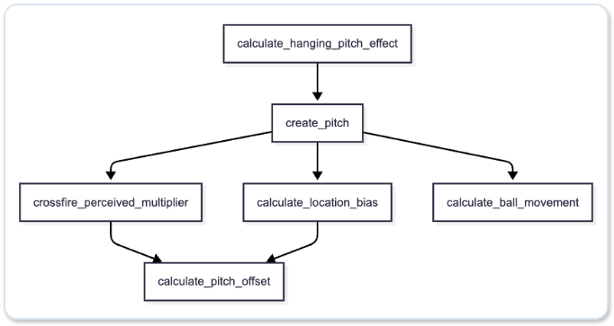

# 投球ロジック

# 投球処理の流れ

# 1. calculate_hanging_pitch_effect

#### 失投の判定

乱数が$\text{PitcherInfo.consistency}$の場合に失投が発生

# 2. create_pitch

投球の結果をPitchedBallにまとめる

## 2.1 spin angle

#### アームスロット別の基本軸

| 投球フォーム | 角度 |
| ---- | ---- |
| Overhand | 25° |
| ThreeQuarter | 55° |
| Sidearm | 85° |
| Submarine | 115° |

#### 左投手の場合の角度の変換

$$\text{spin\_dir} = (360.0 - \text{spin\_dir})\bmod 360.0$$

## 2.2 pitch calling

球種とコースを決定

#### 球種

投手の球種別の確率分布から決定

#### コース

デフォルトのコース別の確率分布から決定

## 2.3 calculate_release_point

#### Z軸(高さ): 身長にフォーム係数を乗算

| 投球フォーム | 係数 |
| ---- | ----: |
| Overhand | 1.05 |
| ThreeQuarter | 0.95 |
| Sidearm | 0.7 |
| Submarine | 0.4 |

#### X軸(横位置): アームスロットによる横への広がり

| 投球フォーム | 係数 |
| ---- | ----: |
| Overhand | 0.35 |
| ThreeQuarter | 0.55 |
| Sidearm | 0.85 |
| Submarine | 0.6 |

#### Y軸 (打者までの距離):

$18.44(m) - PitcherInfo.extension$

- 18.44m：マウンドからホームベースまでの距離

# 3. crossfire_perceived_multiplier

#### 打者の慣れによる入射角の補正

$$\text{HAA}_{\text{perceived}} = \text{HAA}_{\text{physical}} \times \text{UnfamiliarityFactor}$$

- 右投手 vs 右打者 / 左投手 vs 左打者（同型）： $\text{UnfamiliarityFactor}=1.0$（標準）
- 右投手 vs 左打者： $\text{UnfamiliarityFactor}=1.0$（左打者は右投手のクロスに慣れているため補正なし）
- 左投手 vs 右打者： $\text{UnfamiliarityFactor}=1.25 〜 1.35$ （希少性による体感角度の強調）

# 4. calculate_location_bias

投球のコースによる打者の着地予測とタイミングのズレを算出

#### タイミングバイアス

- 内角：最大 +12ms
- 外角：最大 -10ms

#### X軸のバイアス

- 内角：詰まり(-)
- 外角：バットの先端(+)

#### Y軸のバイアス

- 高め：ボールの上を叩く(-)
- 低め：ボールの下を叩く(+)

# 5. calculate_pitch_offset

1. 打者のスイング判断時点から実際のインパクト時点までの残り時間の計算

2. 残り時間における水平方向のズレの計算
$$\text{spacial\_offset\_x} = \frac{1}{2} \cdot (\Delta x_{\text{actual}} - \Delta x_{\text{predicted}}) \cdot t_{\text{remaining}}^2 $$

3. 水平方向のズレにクロスファイアー、コース、リリースポイントの影響を加算
$$\text{enhanced\_offset\_x} = \text{spacial\_offset\_x} \cdot \text{crossfire\_multiplier} \cdot \text{release\_x\_factor} + \text{location\_bias} $$

4. 残り時間における垂直方向のズレの計算
$$\text{spacial\_offset\_y} = \frac{1}{2} \cdot (\Delta y_{\text{actual}} - \Delta y_{\text{predicted}}) \cdot t_{\text{remaining}}^2 $$

5. 垂直方向のズレにコースの影響を加算

$$\text{enhanced\_offset\_y} = \text{spacial\_offset\_y} + \text{location\_bias} $$

6. タイミングのズレにコースの影響を加算

$$\text{enhanced\_timing\_offset} = \text{timing\_offset} + \text{location\_bias} $$

# 6. calculate_ball_movement

1. 打者のインパクト時点までの投球の飛行時間の計算
2. 水平方向の移動距離の計算
3. 垂直方向の移動距離の計算
- 重力の影響を含める
