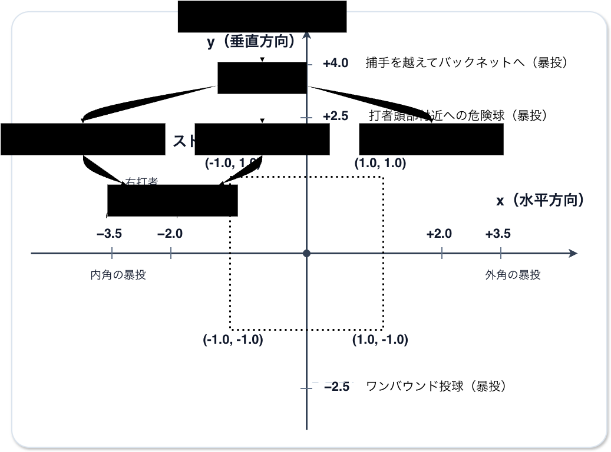
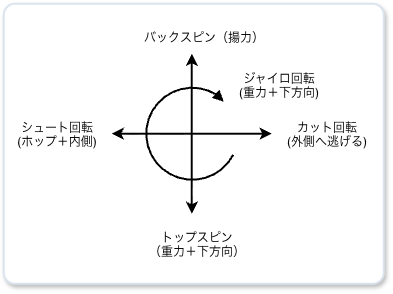

# 投球の空間座標

#### デッドボールの条件

- 見送った場合
  - 避ける動作に成功した場合、ボール
  - 避ける動作に失敗した場合、デッドボール
- スィングした場合
  - バットに当たった場合、グリップ直撃のファール、または、ピッチャーゴロ
  - 空振りの場合、ストライク

#### 暴投の条件

- 見送った場合
  - ボール、ランナーがいた場合は進塁判定
  - スィングした場合
    - ストライク（バットには当たらない）

# 投球の物理

### スピン軸別の効果

### アームスロット別の直球のスピン方向

| 投球フォーム | 右投手（時計 / 角度） | 左投手（時計 / 角度）|
| ---- | ---- | ---- |
| オーバースロー | 1:00 前後（約30°） | 11:00 前後（約330°） |
| スリークォーター | 2:00 前後（約60°） | 10:00 前後（約300°） |
| サイドスロー | 3:00 前後（約90°） | 9:00 前後（約270°） |
| アンダースロー | 4:00 前後（約120°） | 8:00 前後（約240°） |

### スピン方向の影響

- バックスピン（下から上への回転）
  - 重力に負けず落ちない（伸びる）直球になる
- トップスピン（上から下への回転）
  - 重力以上に急速に落下。
- サイドスピン（横回転）
  - 右打者の外角へ逃げる（スライダー）、または内角へ食い込む（シュート）軌道を作る
- ジャイロ回転（ライフル弾のようなドリル回転）
  - 空気抵抗を最小限に抑えて重力に従って落下

### 変化球のスピン軸への影響

- 右投手の場合：
  - スライダー（反時計回り）：基本軸からマイナス方向（左へ）
  - シュート・チェンジアップ（時計回り）：基本軸からプラス方向（右へ）

- 左投手の場合：
  - スライダー（時計回り）：基本軸からプラス方向（右へ）
  - シュート・チェンジアップ（反時計回り）：基本軸からマイナス方向（左へ）

### 回転数(rpm)の影響

- 回転数が高い場合
  - ストレート：バットの下を通過しやすくなり、空振りやポップフライが増える
  - カーブ：落差が激しくなる
- 回転数が低い場合
  - ストレート：マグヌス効果が働かないため、重力で落ちやすくなる
  - 落ちる球（フォークやチェンジアップなど）：落差が激しくなる

### 直球と比較した場合の変化球の変化量

**1. マグヌス効果による変化力（変化量）の算出**

$$k = \text{effective\_spin} \cdot v \cdot C_{\text{magnus}} \quad (C_{\text{magnus}} \approx \text{定数})$$
$$\text{effective\_spin} = \text{spin\_rate} \cdot \text{spin\_efficiency}$$

- $\text{effective\_spin}$：回転数（$\text{spin\_rate}$）に回転効率（$\text{spin\_efficiency}$）を掛けた実際に変化に寄与する回転数
- $v$（球速）：空気とボールが摩擦する相対速度。球速が速いほど発生する空気抵抗とマグヌス力も大きくなる

$$\Delta X = k \cdot \sin(\text{spin\_dir}) \quad (\text{横変化量})$$
$$\Delta Y = k \cdot \cos(\text{spin\_dir}) - Y_{\text{fastball\_ref}} \quad (\text{縦変化量：標準直球との差})$$

- 縦変化量には常に重力加速度（$\approx 9.81 \text{ m/s}^2$） が含まれる
- 標準直球との差は、力で落ちるはずの予測からの乖離となる

**2. 変化量の比較**

| 投球のタイプ |球速 | rpm | 角度 | 変化量の差 $D$ |
| ---- | ---- | ---- | ---- | ---- |
| 平均的ストレート  | 150km/h | 2300rpm | 0° | $D \approx 0.00$ |
| 高回転ストレート  | 155km/h | 2700rpm | 0° | $D \approx 0.17$ |
| ジャイロカット  | 145km/h | 1200rpm | 270° | $D \approx 1.12$ |
| ドロップカーブ  | 125km/h | 2500rpm | 180° | $D \approx 2.08$ |

### リリースポイント

#### $Z$ 軸（高さ）：身長 × アームスロット

- 構成要素： $\text{身長} \times \text{アームスロットの角度} - \text{沈み込み（膝・マウンド）}$
- マウンドからの高さ：
  - オーバースロー：1.9m 〜 2.1m
  - スリークォーター：1.6m 〜 1.8m
  - サイドスロー：1.2m 〜 1.4m
  - アンダースロー：0.5m 〜 0.9m
- 影響：$Z$ が高いほど入射角がついて球速感が増し、$Z$ が低いほど浮き上がるような錯覚を生む

#### $X$ 軸（左右）：左右の投げ腕 × アームスロット × 踏み出し位置

- 構成要素： $\text{利き腕 (+/-)} \times \text{アームスロットの広がり} + \text{プレート上の立ち位置}$
- X軸の向きと距離：
  - 右投手（$+X$ 方向）： $+0.3\text{m}$（オーバースロー）〜 $+0.9\text{m}$（サイドスロー）
  - 左投手（$-X$ 方向）： $-0.3\text{m}$（オーバースロー）〜 $-0.9\text{m}$（サイドスロー）
- 影響：$X$の絶対値が大きいほどクロスファイヤーが急になり、右vs右、左vs左の場合のボールが見えにくくなる効果を生む

#### $Y$ 軸（前後・エクステンション）：投手の個性（リリース前後の癖）

- 構成要素： プレートから何メートル前に出てリリースしたか
- プレートからの踏み出し距離：
  - 平均的投手：1.8m 〜 1.9m （$Y \approx 16.55\text{m} \sim 16.64\text{m}$）
  - リリースが早い投手：1.5m 〜 1.7m （打者までが遠く感じる）
  - リリースが遅い投手：2.0m 〜 2.2m （打者までが近く感じ、体感速度が激増する）
- 影響： $Y$が打者寄りに近いほど、打者の体感球速が向上し、タイミングが取りにくくなる

### リリースポイントから打者の打撃地点までボールが到着するまでの時間

ホームベース上の打撃ポイントまでの実質距離 $D_{\text{flight}}$ ：

$$D_{\text{flight}} = \text{release\_point.y} \quad (\text{例: } 18.44\text{m} - 1.9\text{m} = 16.54\text{m})$$

空気抵抗による減速を考慮した平均球速 $v_{\text{avg}}$ （$\text{m/s}$）：

$$v_{\text{avg}} = \left( \frac{\text{speed\_kmh}}{3.6} \right) \times \text{DRAG\_FACTOR} \quad (\text{DRAG\_FACTOR } \approx 0.95)$$

ボールが到着するまでの時間（flight_time）：

$$\text{flight\_time} = \frac{D_{\text{flight}}}{v_{\text{avg}}}$$

### 投手視点でのスピンの活用方法

回転の方向を変えることでバッターの目線を散らし、回転の速さで予想以上の変化量を生み出してバットの芯を外す

**例**

| 球種 | スピン回転数 | スピン角度 | スピン効率 | X変化量 | 打者の手元での挙動 |
| ---- | ---- | ---- | ---- | ---- | ---- |
| スライダー | 2600rpm | 90° | 0.85 | +3.2m/s² | 外角へ一気に逃げていく |
| ジャイロカット | 2400rpm | 90° | 0.25 | +0.7m/s² | わずかに動いて芯を外す |
| シュート / シンカー | 2200rpm | 270° | 0.80 | -2.5m/s² | 胸元へ鋭く食い込む |
| クセのないストレート | 2400rpm | 0° | 0.95 | 0.0m/s² | ピッチトンネルをそのまま通る |

### 着地予測のズレ

**決断時点（$t_d$）**
- 位置 $y(t_d) = \frac{1}{2} a t_d^2$
- 速度 $y'(t_d) = a t_d$

**打者のスイング判断時点（$t_f$）での予測:**

$$y_{\text{predicted}} = \frac{1}{2} a t_d^2 + a t_d (t_f - t_d) = a t_d t_f - \frac{1}{2} a t_d^2$$

**実際の到着地点**

$$y_{\text{actual}} = \frac{1}{2} a t_f^2$$

**予測との差分**

$$\text{spacial\_offset\_y} = y_{\text{actual}} - y_{\text{predicted}} = \frac{1}{2} a (t_f - t_d)^2$$

### タイミングのズレ

$$\Delta t = t_{\text{actual}} - t_{\text{expected}}$$

- $t_{\text{actual}}$：実際のボール通過時間
- $t_{\text{expected}}$：打者の予測時間
- $\Delta t > 0$ ：振り遅れ
  - 想定より球が早く到達した、あるいは自分の振り出しが遅れた
- $\Delta t < 0$ ：泳がされる
  - 想定より球が遅く到達した、あるいは自分の振り出しが早まった

#### ズレの原因1：踏み出し距離

$$\Delta t_{\text{extension}} = \frac{18.44 - \text{extension}}{v_{\text{avg}}} - \frac{18.44 - \text{std\_extension}}{v_{\text{avg}}}$$

- 例：
  - リリースポイントのYが2.1mの場合、1.85mの投手より約6ミリ秒、ボールが早く到達する

#### ズレの原因2：打者の予測球速とのギャップ

- ストレートの体感速度
  - リリースポイントが長く、高回転の場合、打者の予測球速よりも体感球速が早くなるため、$\Delta t > 0$（振り遅れ）になる

- チェンジアップ・フォークの緩急（緩急差）
  - ストレートと同じフォームで球速の遅いチェンジアップやフォークが来ると、$\Delta t < 0$（泳がされる） になる

#### ズレの原因3：縦の変化

- ドロップ系（フォーク/カーブ）
  - 縦の変化により、バットの軌道とボールの軌道が交差する点を通過するタイミングが前後にズレる

#### ズレの原因4：投球のコース

| コース | インパクトポイント | 影響 | メカニズム |
| ---- | ---- | ---- | ---- |
| 内角 | 前 | $+\Delta t$（振り遅れ） | バットのヘッドが回る前にボールが到達するため、反応時間が短くなる |
| 外角 | 後 | $-\Delta t$（泳がされる） | ボールを呼び込んで叩くため、反応時間が長くなる |
| 高め | やや前 | $+\Delta t$（振り遅れ） | スイング軌道の最短ルートから外れるため、スイング始動が遅れる |
| 低め | やや後 | $-\Delta t$（泳がされる） | 重力に従ってスイング軌道になるため、引きつけて捉えやすい |

**打者のコース予測による影響**

$$\Delta \text{Loc} = \text{Loc}_{\text{actual}} - \text{Loc}_{\text{expected}}$$

- $\text{Loc}_{\text{actual}}$：実際のコース
- $\text{Loc}_{\text{actual}}$：打者のコース予測
- $\Delta \text{Loc}$：予測誤差
  - 予測に近ければコースによるバイアスが緩和され、予測から遠ければバイアスが増幅される

